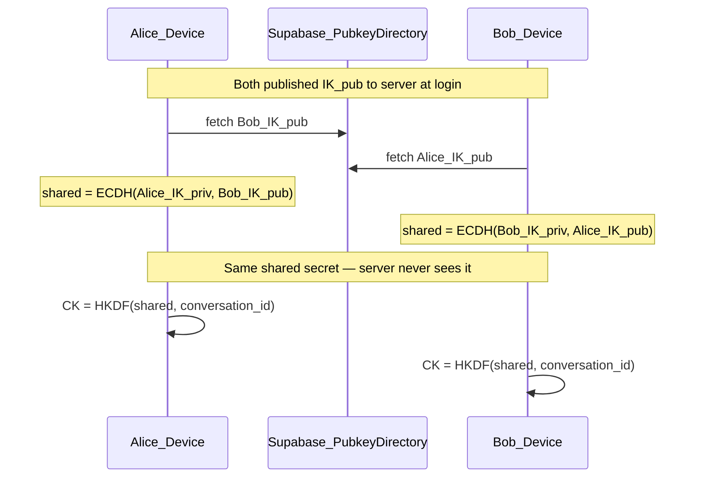
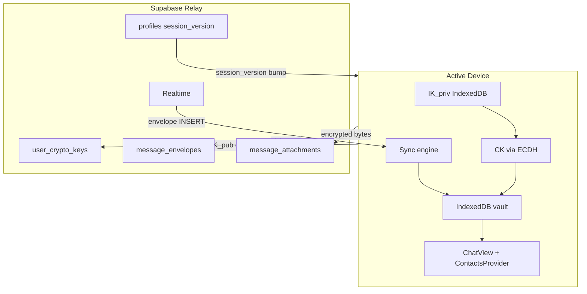
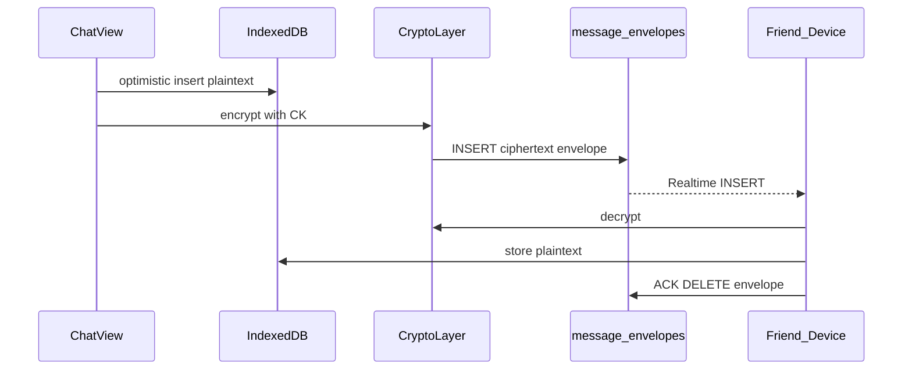
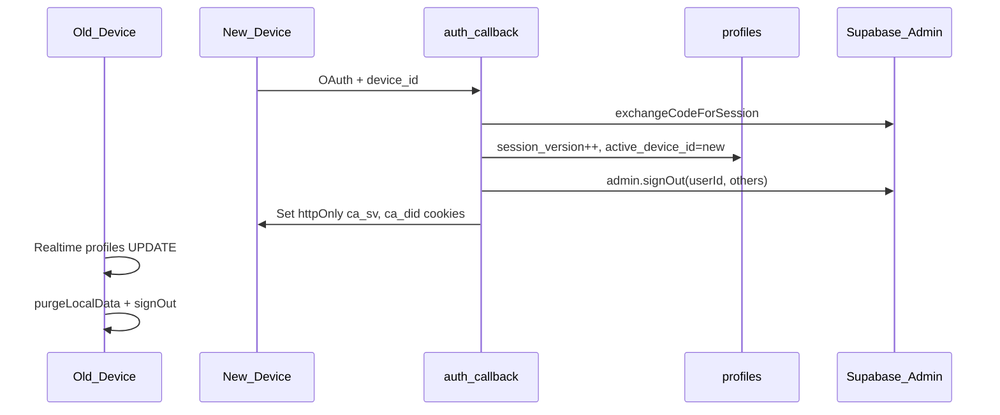

# E2EE + Local-Only Chat — Architecture Plan

## Product contract (v1)

| Rule | Behavior |
|------|----------|
| Single active device | New login succeeds; old device is revoked and must wipe local data |
| History on device | Decrypted messages only in IndexedDB |
| Logout | Wipe IndexedDB + crypto keys + revoke session |
| New device | Empty vault; `key_generation++`; friends re-run ECDH with new pubkey |
| Images | Client-encrypted blobs on server; auto-deleted after 24h |
| Server relay | Ciphertext envelopes only (7-day TTL, deleted on ACK) — not history |
| No legacy data | Delete all existing plaintext messages and images. No import, no backup. |
| Multi-device | Deferred to v2 |

---

## Where chat lives

| | Today (current) | After E2EE v1 |
|--|-----------------|---------------|
| Message text | Postgres `messages.body` — plaintext | IndexedDB — decrypted |
| History source of truth | Server | Active device |
| In-memory UI | React `useState` in ChatView | View over IndexedDB vault |
| Images | Public `chat-media` bucket URLs | Client-encrypted private bucket (24h TTL) |
| Logout / new device | History still on server | Everything gone on that device |

---

## Cryptography

### Key material — what goes where

| Key | On server? | On device? | Purpose |
|-----|------------|------------|---------|
| Identity private key (`IK_priv`) | **No** | IndexedDB only | ECDH key agreement |
| Identity public key (`IK_pub`) | **Yes** — `user_crypto_keys` | IndexedDB copy | Peers fetch to run ECDH |
| Conversation key (`CK`) | **No** | IndexedDB only | Encrypt/decrypt messages |
| Attachment key (`AK`) | **No** | Inside encrypted message | Per-image encryption |
| Shared DH secret | **No** | Never stored | Used once to derive CK |

The server is a **public key directory**. It cannot decrypt messages.

### Key agreement: Diffie-Hellman (ECDH / X25519)



**Derivation:**

```
shared = X25519(my_IK_priv, peer_IK_pub)
CK = HKDF-SHA256(shared, salt=conversation_id, info="callingapp-ck-v1-{peer_key_generation}")
```

**Per message:**

```
nonce = random 12 bytes
AAD = conversation_id || sender_id || message_id || type || sender_key_generation
ciphertext = AES-256-GCM(CK, nonce, plaintext, AAD)
```

**Library:** Web Crypto API for HKDF + AES-GCM; `@noble/curves` fallback for X25519 if needed. Code in `packages/core/src/crypto/`.

### Key lifecycle

1. **First login:** generate X25519 keypair; store `IK_priv` in IndexedDB; upload `IK_pub` + `key_generation=1`.
2. **Friendship accepted:** fetch peer `IK_pub`, run ECDH, derive CK, TOFU-pin pubkey.
3. **Send:** encrypt with CK → insert envelope → store decrypted copy locally.
4. **Receive:** Realtime envelope → decrypt → IndexedDB → ACK → delete envelope.
5. **New device:** new keypair, `key_generation++`, empty vault, friends derive new CK.
6. **Logout:** wipe entire IndexedDB vault.

### Trust model

- **TOFU** pin at first key exchange.
- **"Security code changed"** banner when peer `key_generation` bumps.
- Protects against honest-but-curious DB admin.
- Does **not** protect against MITM without safety numbers, XSS, or metadata analysis.

---

## Architecture



### Send flow



---

## Local storage (IndexedDB vault)

Database name: `callingapp-vault-{userId}`. Wiped on logout and session-replace.

| Store | Contents |
|-------|----------|
| `device_identity` | `IK_priv`, local `IK_pub` |
| `crypto_material` | CK per `(conversationId, peerKeyGeneration)` |
| `trusted_pubkeys` | TOFU-pinned friend pubkeys |
| `messages` | Decrypted history, indexed `[conversationId+createdAt]` |
| `conversations` | Sidebar: preview, unread, lastReadAt |
| `outbox` | Pending encrypted envelopes |
| `attachments_cache` | Decrypted image blobs (LRU) |
| `message_hides` | Local-only hide flags |

**Source of truth:** IndexedDB. React state is a view over the vault.

---

## Server schema

### New tables

```sql
user_crypto_keys (
  user_id uuid PRIMARY KEY REFERENCES profiles(id),
  identity_pubkey bytea NOT NULL,
  key_generation int NOT NULL DEFAULT 1,
  updated_at timestamptz NOT NULL DEFAULT now()
)

message_envelopes (
  id uuid PRIMARY KEY,
  conversation_id uuid NOT NULL REFERENCES conversations(id),
  sender_id uuid NOT NULL REFERENCES profiles(id),
  recipient_id uuid NOT NULL REFERENCES profiles(id),
  type text NOT NULL,                    -- text | image
  ciphertext bytea NOT NULL,
  nonce bytea NOT NULL,
  sender_key_generation int NOT NULL,
  attachment_id uuid REFERENCES message_attachments(id),
  created_at timestamptz NOT NULL DEFAULT now(),
  expires_at timestamptz NOT NULL DEFAULT (now() + interval '7 days')
)

message_attachments (
  id uuid PRIMARY KEY,
  conversation_id uuid NOT NULL REFERENCES conversations(id),
  storage_path text NOT NULL,
  ciphertext_size int NOT NULL,
  expires_at timestamptz NOT NULL DEFAULT (now() + interval '1 day'),
  created_at timestamptz NOT NULL DEFAULT now()
)
```

### Profile additions (single-device session)

```sql
ALTER TABLE profiles
  ADD COLUMN session_version bigint NOT NULL DEFAULT 1,
  ADD COLUMN active_device_id text,
  ADD COLUMN active_session_at timestamptz;
```

### Legacy purge (no migration)

On E2EE launch:

1. `DELETE` all rows in `messages`
2. Delete all objects in public `chat-media` bucket
3. Stop using `latest_message_previews` and server unread RPCs
4. Remove SSR plaintext fetch from `chat/[id]/page.tsx`

Users start with empty threads.

### Storage

- New private bucket: `chat-media-private` (not public)
- All uploads via authenticated API routes
- Cron deletes expired attachments daily

---

## Single-device session



| Layer | Implementation |
|-------|----------------|
| Device ID | `crypto.randomUUID()` in localStorage |
| Login | Extend `auth/callback/route.ts` |
| Per-request | Middleware compares cookies to `profiles` |
| Instant kick | Realtime `profiles` UPDATE listener |
| Logout | Wipe IndexedDB + `signOut()` in settings |

**Pitfall:** JWT may remain valid ~1h after revoke. Cookie gate is mandatory.

---

## Images (client E2EE, 24h server TTL)

1. Compress image client-side
2. Generate random `AK`; encrypt with AES-GCM
3. Upload ciphertext via `POST /api/chat/attachments`
4. Send envelope with encrypted `{ ak, attachment_id }` inside message ciphertext
5. Recipient decrypts → caches in `attachments_cache`
6. Cron at `0 3 * * *` deletes expired blobs; UI shows "Image expired"

Server never has `AK`. Local cache survives until logout.

---

## UI / data dependency rewrite

| Current file | Change |
|--------------|--------|
| `chat/[id]/page.tsx` | Remove SSR message fetch; auth + friend profile only |
| `lib/chat/messages.ts` | IndexedDB pagination instead of Postgres |
| `lib/contacts/load-contacts.ts` | Remove preview/unread RPCs; local vault |
| `contexts/contacts-context.tsx` | Decrypt envelopes; update vault |
| `chat/[id]/chat-view.tsx` | Encrypt send; decrypt receive; envelope Realtime |
| `lib/chat/upload-image.ts` | Client encrypt → API upload |
| `components/settings/settings-dialog.tsx` | Logout wipes vault |

### Features deferred or broken

| Feature | v1 handling |
|---------|-------------|
| Server link previews | Disable or client-side post-decrypt |
| Server unread badges | Client-only from vault |
| Global soft-delete | Local-only delete or encrypted tombstone (TBD) |
| Group chat E2EE | Deferred |
| Push with message body | Generic "New message" only |

---

## Future: multi-device (v2)

Multi-device **can** be supported later. v1 choices are compatible.

| v1 | v2 extension |
|----|--------------|
| One `IK_pub` per user | `user_devices` table: one pubkey per device |
| `active_device_id` on profile | N registered devices; remove-device UX |
| One envelope per recipient | Fan-out per recipient device |
| No history sync | Encrypted vault backup (passphrase) or QR transfer |

### v1 design rules (keep v2 easy)

1. Never derive `IK` from OAuth tokens
2. Keep `sender_key_generation` on envelopes (extend to `sender_device_id` in v2)
3. Abstract `getPeerPublicKeys(userId)` — v1 returns one key, v2 returns many
4. Session wipe is per-device, not per-user

---

## Threat model

| Protected against | Not protected against |
|-------------------|----------------------|
| DB breach / curious admin reading messages | XSS stealing `IK_priv` |
| | Metadata (timestamps, sizes, social graph) |
| | MITM without safety numbers |
| | Device loss without backup |
| | Peer retaining history after your wipe |

No forward secrecy in v1 (static CK per key generation). Document this limitation.

---

## Risks

1. **All history lost at cutover** — intentional; release notes required
2. **Data loss on logout/new device** — by design in v1
3. **Pubkey substitution** — TOFU + security code changed banner
4. **XSS** — strict CSP required
5. **Image/server TTL mismatch** — text permanent local, images expire server-side; label in UI
6. **ECDH re-key race** — envelopes carry `sender_key_generation`; keep multiple CK versions

---

## Key files (current codebase)

| Path | Role |
|------|------|
| `apps/web/src/app/(app)/(messages)/chat/[id]/chat-view.tsx` | Send/receive (major rewrite) |
| `apps/web/src/app/(app)/(messages)/chat/[id]/page.tsx` | SSR entry (remove messages) |
| `apps/web/src/lib/chat/messages.ts` | Pagination |
| `apps/web/src/contexts/contacts-context.tsx` | Global realtime |
| `apps/web/src/lib/contacts/load-contacts.ts` | Sidebar data |
| `apps/web/src/app/auth/callback/route.ts` | Login + device registration |
| `apps/web/src/lib/supabase/middleware.ts` | Session gate |
| `packages/core/src/types.ts` | Shared types |
| `supabase/migrations/` | Schema changes |