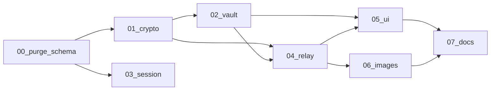

# E2EE Implementation Tasks

Tasks are ordered by dependency. Each phase should land as small commits (≤100 lines, ≤3 files per commit per ship-feature skill).

## Task index

| # | Task | Depends on | Est. effort | Status |
|---|------|------------|-------------|--------|
| 0 | [00-purge-and-schema](./00-purge-and-schema.md) | — | Medium | Partial (SQL written, not applied) |
| 1 | [01-crypto-module](./01-crypto-module.md) | 0 | Medium | Done |
| 2 | [02-indexeddb-vault](./02-indexeddb-vault.md) | 1 | Medium | Done |
| 3 | [03-single-device-session](./03-single-device-session.md) | 0 | Medium | Done |
| 4 | [04-encrypted-relay](./04-encrypted-relay.md) | 1, 2 | Large | Done (libs + chat wired) |
| 5 | [05-ui-rewire](./05-ui-rewire.md) | 2, 4 | Large | Partial (chat done; contacts pending) |
| 6 | [06-encrypted-images](./06-encrypted-images.md) | 4 | Medium | Partial (stubs only) |
| 7 | [07-architecture-doc](./07-architecture-doc.md) | All | Small | Done |

## Dependency graph

## Parallel workstreams

After task 0 lands, these can proceed in parallel:

- **Crypto track:** 01 → 02 → 04 → 05
- **Session track:** 03 (independent until UI integration)
- **Images:** 06 after 04

## Global exit criteria

- [ ] No plaintext in `messages.body` for new traffic
- [ ] Decrypted history only in IndexedDB
- [ ] Only `IK_pub` on server; `IK_priv` never leaves device
- [ ] Single active device enforced
- [ ] Logout wipes vault completely
- [ ] Images encrypted client-side; server blobs expire after 24h
- [ ] `pnpm test` and `pnpm build` pass
- [x] `architecture/features/e2ee-local-chat.md` updated