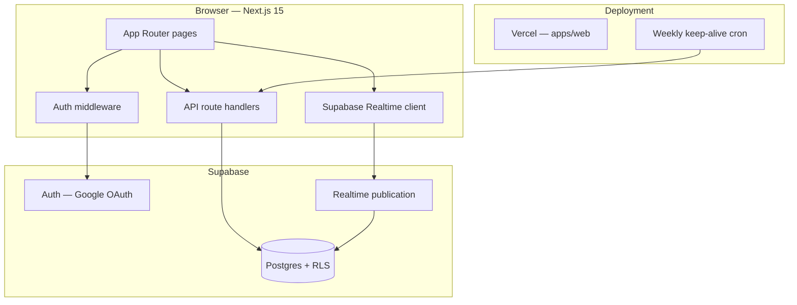

# CallingApp Architecture

Blueprint documentation for building, extending, and operating CallingApp.

CallingApp is a **free, web-first 1-on-1 chat application**. Users sign in with Google, receive a shareable public ID, add friends by that ID, and exchange real-time text messages.

## Documentation map

| Folder | Purpose |
|--------|---------|
| [`features/`](./features/) | Completed capabilities — how they work today, with file maps, flows, APIs, and schema |
| [`plans/`](./plans/) | Phased rollout plans — `phase1/` (active) through `phase4/` |
| [`feature-tests/`](./feature-tests/) | Manual test guides and scenario test plans per feature |

## System overview



## Monorepo layout

```
CallingApp/
├── apps/web/              Next.js 15 frontend + API routes
├── packages/core/         Shared types and pure utilities
├── supabase/migrations/   Postgres schema, triggers, RLS
└── architecture/          This documentation
```

## Tech stack

| Layer | Choice | Role |
|-------|--------|------|
| Framework | Next.js 15 (App Router) | SSR pages, API routes, middleware |
| Styling | Tailwind CSS 4 | Mobile-first dark UI |
| Auth | Supabase Auth + `@supabase/ssr` | Google OAuth, cookie sessions |
| Database | Supabase Postgres | Profiles, friendships, conversations, messages |
| Realtime | Supabase Realtime | Live message delivery |
| Package manager | pnpm workspaces | Monorepo orchestration |
| Hosting | Vercel | Web app + cron jobs |

## Route map

| Route | Type | Feature doc |
|-------|------|-------------|
| `/` | Redirect | [Authentication](./features/authentication.md) |
| `/login` | Public | [Authentication](./features/authentication.md) |
| `/auth/callback` | OAuth handler | [Authentication](./features/authentication.md) |
| `/onboarding` | Auth-gated | [Onboarding & Profiles](./features/onboarding-and-profiles.md) |
| `/home` | Protected | [Contacts Home](./features/contacts-home.md) |
| `/friends/add` | Protected | [Friends](./features/friends.md) |
| `/chat/[id]` | Protected | [Realtime Chat](./features/realtime-chat.md) |
| `/settings` | Protected | [Settings](./features/settings.md) |

## API map

| Endpoint | Method | Feature doc |
|----------|--------|-------------|
| `/api/profile/onboarding` | POST | [Onboarding & Profiles](./features/onboarding-and-profiles.md) |
| `/api/profile` | PATCH | [Settings](./features/settings.md) |
| `/api/friends/lookup` | GET | [Friends](./features/friends.md) |
| `/api/friends/request` | POST | [Friends](./features/friends.md) |
| `/api/friends/respond` | POST | [Friends](./features/friends.md) |
| `/api/cron/keep-alive` | GET | [Infrastructure](./features/infrastructure.md) |

## Environment variables

| Variable | Scope | Required | Purpose |
|----------|-------|----------|---------|
| `NEXT_PUBLIC_SUPABASE_URL` | Client + server | Yes | Supabase project URL |
| `NEXT_PUBLIC_SUPABASE_ANON_KEY` | Client + server | Yes | Public anon key (RLS-enforced) |
| `SUPABASE_SERVICE_ROLE_KEY` | Server only | For cron | Bypass RLS for keep-alive ping |
| `CRON_SECRET` | Server only | Production | Protects `/api/cron/keep-alive` |

See `.env.example` at repo root.

## Completed features (index)

1. [Authentication](./features/authentication.md) — Google OAuth, session cookies, route guards
2. [Onboarding & Profiles](./features/onboarding-and-profiles.md) — Display name, public ID generation
3. [Friends](./features/friends.md) — Lookup, request, accept/reject
4. [Realtime Chat](./features/realtime-chat.md) — 1-on-1 text messaging (legacy plaintext path)
5. [Contacts Home](./features/contacts-home.md) — Friend list sorted by recent activity
6. [Settings](./features/settings.md) — Profile edit, copy ID, logout
7. [Data Model & Security](./features/data-model-and-security.md) — Schema, RLS, triggers
8. [Shared Core Package](./features/shared-core.md) — `@calling-app/core` utilities
9. [UI Shell](./features/ui-shell.md) — Layout, navigation, design tokens
10. [Infrastructure](./features/infrastructure.md) — Cron, build, deploy, testing

## In progress

- [E2EE Local Chat](./features/e2ee-local-chat.md) — End-to-end encrypted messaging, IndexedDB vault, single-device session ([implementation plan](../apps/e2e/PLAN.md))

## Future plans (index)

| Phase | Focus | Doc |
|-------|-------|-----|
| 1 (active) | End-to-end chat + good UI | [plans/phase1/](./plans/phase1/) |
| 2 | Social & identity | [plans/phase2/](./plans/phase2/) |
| 3 | PWA + notifications | [plans/phase3/](./plans/phase3/) |
| 4 | Voice/video (deferred) | [plans/phase4/](./plans/phase4/) |

See [`plans/README.md`](./plans/README.md) for the full roadmap.

## Conventions for extending the codebase

When adding a new feature:

1. **Schema first** — Add a migration under `supabase/migrations/` with RLS policies.
2. **Core types** — Add shared types to `packages/core/src/types.ts` if reused.
3. **API routes** — Use server-side Supabase client from `@/lib/supabase/server` for privileged logic.
4. **Client data** — Prefer direct Supabase client inserts/selects where RLS is sufficient; use API routes for validation-heavy or cross-table operations.
5. **Realtime** — Subscribe in client components; filter by `conversation_id` or user scope.
6. **Document** — Add a feature doc under `architecture/features/` when shipped; move plan doc from `architecture/plans/` or mark it done.

## Local development

```bash
pnpm install
pnpm dev        # starts apps/web on :3000
pnpm test       # core + web unit tests
pnpm build      # production build
pnpm lint       # eslint
```

Supabase setup: run `supabase/migrations/20250625000001_initial_schema.sql`, enable Google provider, add redirect `http://localhost:3000/auth/callback`.