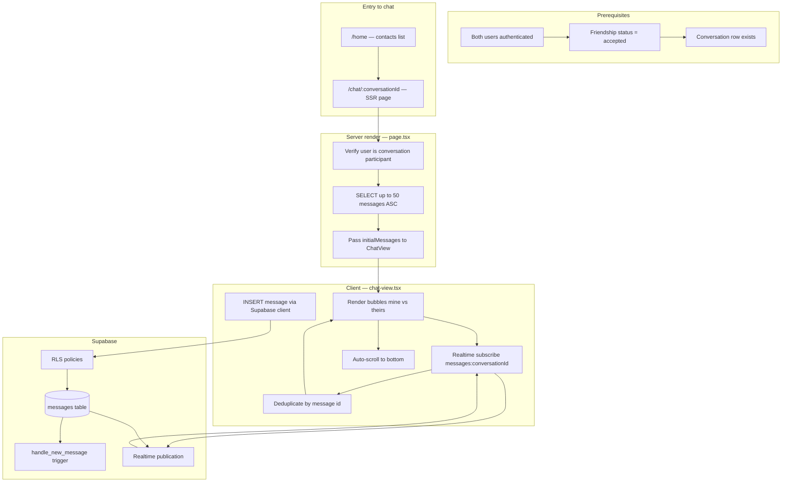
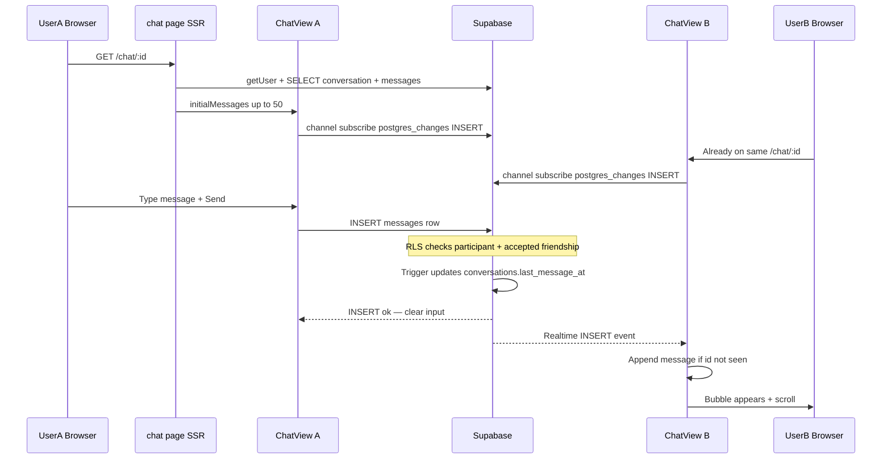

# Current Chat Architecture

How two accepted friends exchange text messages in CallingApp today.

## Summary

Chat is **1-on-1 only**. Messages are stored in Supabase Postgres and delivered in real time via **Supabase Realtime** (`postgres_changes` on the `messages` table). There is no custom WebSocket server — the browser talks directly to Supabase using the anon key, with **Row Level Security (RLS)** enforcing who can read and write.

## End-to-end flow



## Sequence: User A sends, User B receives



## Prerequisites chain

Two people can only chat when **all** of the following are true:

| Step | Mechanism | Result |
|------|-----------|--------|
| 1. Sign in | Google OAuth + Supabase session | `auth.users` + stub `profiles` row |
| 2. Onboarding | `POST /api/profile/onboarding` | `display_name` + `public_id` set |
| 3. Add friend | Lookup by public ID + `POST /api/friends/request` | `friendships` row `pending` |
| 4. Accept | `POST /api/friends/respond` action=accept | `friendships` status `accepted` |
| 5. Conversation | DB trigger `handle_friendship_accepted` | `conversations` row with canonical user pair |
| 6. Open chat | `/home` → tap contact → `/chat/:id` | Both users use same `conversation.id` |

If friendship is `pending` or `blocked`, RLS **blocks** message INSERT even if a conversation row exists.

## Component responsibilities

### [`page.tsx`](../../../apps/web/src/app/(app)/chat/[id]/page.tsx) — Server

| Responsibility | Detail |
|----------------|--------|
| Auth gate | Redirect to `/login` if no session |
| Participant check | Redirect to `/home` if user not in `user_a_id` / `user_b_id` |
| Friend resolution | Load other participant's profile for header title |
| History load | `SELECT` messages `ORDER BY created_at ASC LIMIT 50` |
| Hydration | Pass `initialMessages` to client `ChatView` |

### [`chat-view.tsx`](../../../apps/web/src/app/(app)/chat/[id]/chat-view.tsx) — Client

| Responsibility | Detail |
|----------------|--------|
| State | `messages` from SSR; `body` for compose input |
| Realtime | Channel `messages:{conversationId}`, filter `conversation_id=eq.{id}`, event `INSERT` |
| Send | `INSERT` + `.select().single()` — append returned row immediately |
| Dedup | Skip append if `message.id` already in state |
| UI | Right bubble = mine (`sender_id === currentUserId`), left = theirs |
| Scroll | `scrollIntoView` on bottom ref when `messages` changes |
| Error handling | Inline `sendError` on INSERT failure; banner if Realtime not subscribed |
| Realtime | Subscribe after `getSession()`; status logged to console |

## Data model (chat-relevant)

### `conversations`

- One row per accepted friend pair
- `user_a_id < user_b_id` (canonical ordering)
- `last_message_at` updated by trigger on each message

### `messages`

| Column | Constraint |
|--------|------------|
| `conversation_id` | FK to conversations |
| `sender_id` | Must equal `auth.uid()` on insert |
| `body` | 1–4000 characters |
| `type` | `'text'` only |
| `created_at` | Auto |

### RLS: who can message?

**SELECT** — user is participant in parent conversation.

**INSERT** — all required:
1. `auth.uid() = sender_id`
2. User is conversation participant
3. `friendships.status = 'accepted'` between the two users

## Realtime design

| Property | Value |
|----------|-------|
| Channel name | `messages:{conversationId}` |
| Event type | `postgres_changes` |
| Table | `public.messages` |
| Filter | `conversation_id=eq.{uuid}` |
| Events listened | `INSERT` only |
| Cleanup | `removeChannel` on unmount |

**Not used today:** Broadcast channels, presence, typing, read receipts.

## Navigation path

```
/home (contacts, sorted by last_message_at)
  └── Link → /chat/{conversationId}
        └── AppShell title = friend display_name
        └── ChatView
```

Contact without `conversationId` links to `/friends/add` (edge case if trigger failed).

## Known gaps affecting “seamless” chat

| Gap | Impact |
|-----|--------|
| 50-message cap | Older history invisible |
| Sender UI | Fixed — bubble from INSERT response (see [troubleshooting.md](./troubleshooting.md)) |
| Receiver Realtime | Still depends on Realtime; verify publication if receiver stale |
| No reconnect handling | Subscription drop not explicitly recovered |
| No duplicate-send guard | Double-click Send can insert twice |
| No empty-message feedback | Whitespace-only submit silently ignored |
| Sender sees own message via realtime | INSERT triggers realtime to sender too; dedup prevents double if same id |

## Related docs

- Feature spec: [../../features/realtime-chat.md](../../features/realtime-chat.md)
- Data model: [../../features/data-model-and-security.md](../../features/data-model-and-security.md)
- Phase 1 improvements: [../../plans/phase1/end-to-end-chat.md](../../plans/phase1/end-to-end-chat.md)