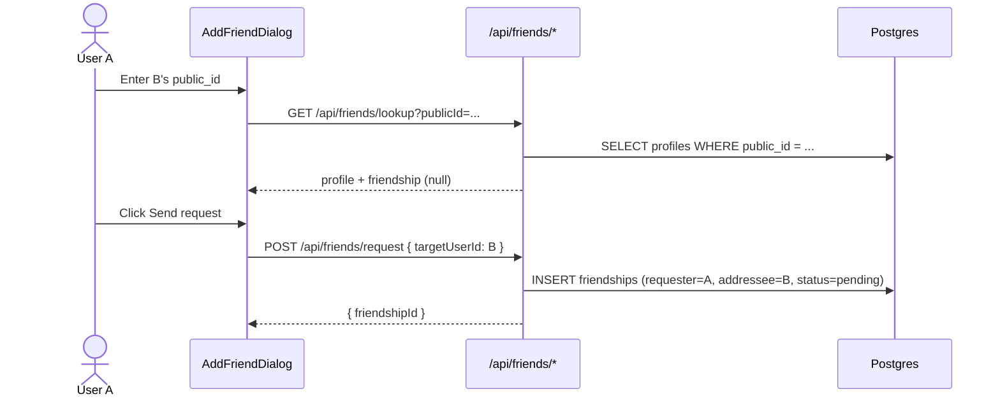
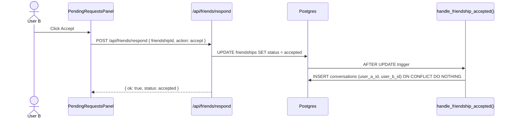
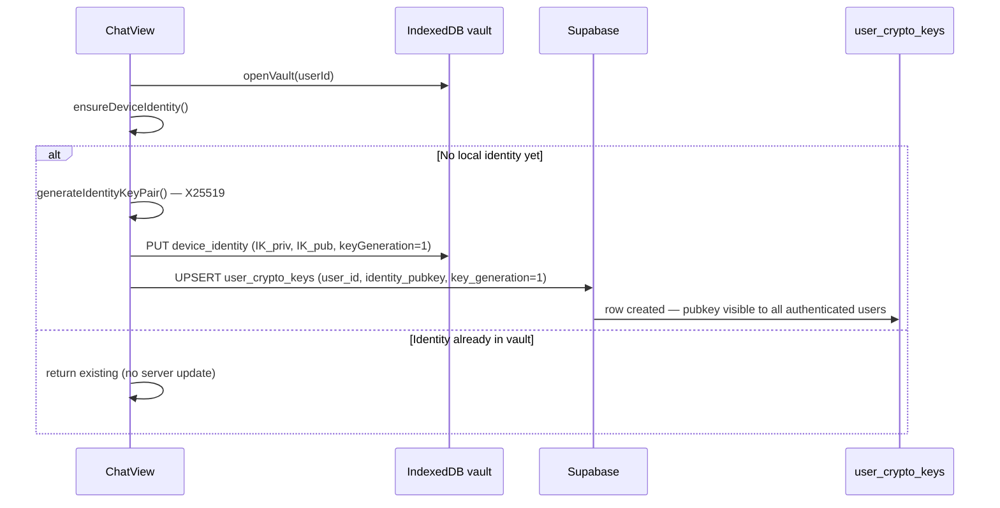
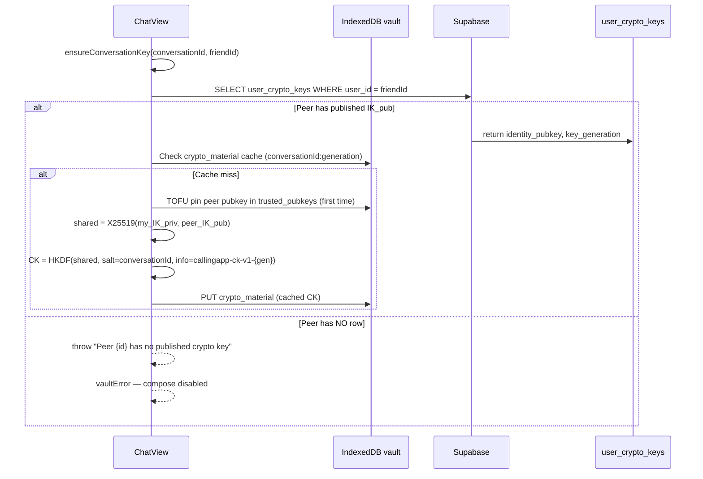
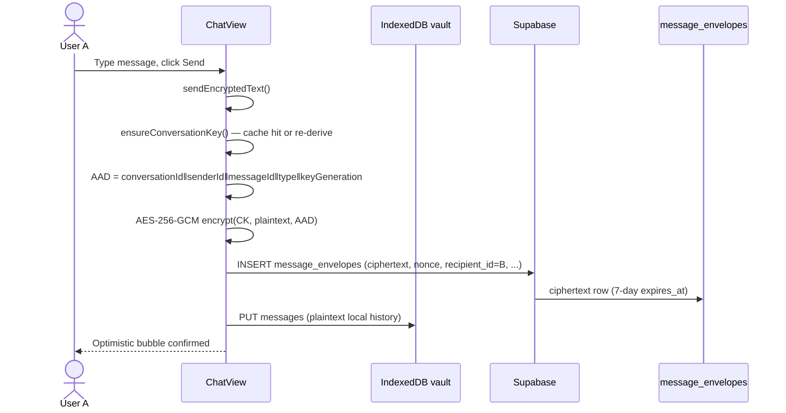
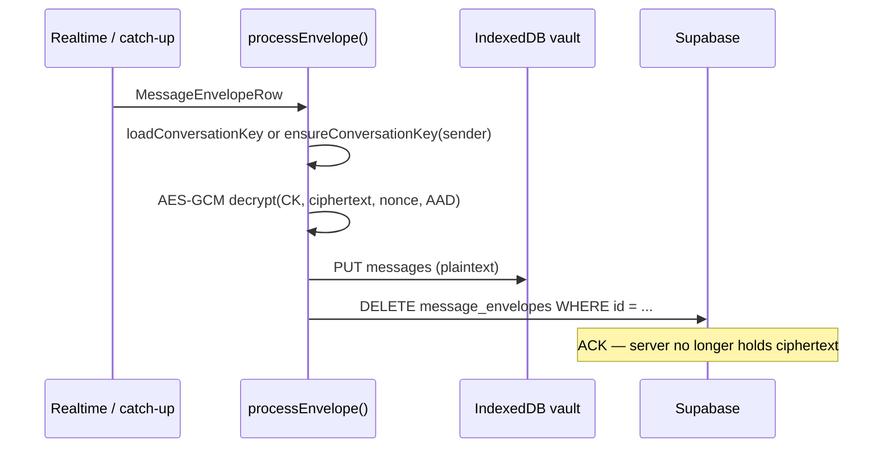
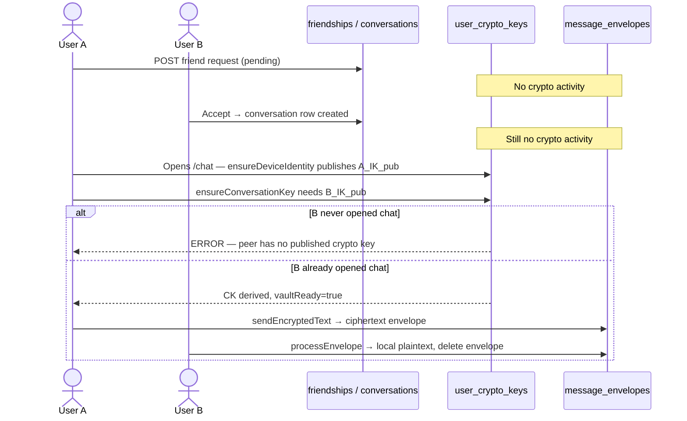

# E2EE Journey: Friend Request → Accept → First Message

End-to-end reference for how CallingApp goes from **User A sends a friend request** to **User B accepts** to **encrypted messages flowing** — and why sends can fail along the way.

**Related docs:** [friends.md](../../features/friends.md) · [e2ee-local-chat.md](../../features/e2ee-local-chat.md) · [send-message-failure.md](../../issuediagnostics/send-message-failure.md)

**Last verified:** 2026-06-28 against `issue-fix-e2e` branch.

---

## TL;DR

| Phase | Crypto? | What happens |
|-------|---------|--------------|
| A sends friend request | **No** | `friendships` row `status=pending` |
| B accepts | **No** | `status=accepted` + `conversations` row created by DB trigger |
| Either user opens chat | **Yes — identity** | Generate X25519 keypair locally; publish `IK_pub` to `user_crypto_keys` |
| Either user opens chat | **Yes — conversation key** | Fetch peer `IK_pub`, ECDH + HKDF → AES-GCM key `CK` (cached in IndexedDB) |
| User sends text | **Yes — encrypt** | Ciphertext inserted into `message_envelopes`; plaintext stored only in local vault |
| Peer receives | **Yes — decrypt** | Realtime or catch-up → decrypt → vault → delete envelope from server |

**Critical:** Friend accept does **not** exchange keys. Keys are exchanged **lazily** when someone opens the chat. If the peer has never opened a chat, their public key is missing and the other side **cannot send**.

---

## Actors and tables

| Actor | Role |
|-------|------|
| **User A** | Sends friend request (requester) |
| **User B** | Accepts request (addressee) |
| **Supabase Postgres** | Social graph, conversation row, pubkey directory, ciphertext relay |
| **IndexedDB vault** | Per-device `IK_priv`, derived `CK`, decrypted message history |

| Table | Used when |
|-------|-----------|
| `friendships` | Request (`pending`) → accept (`accepted`) |
| `conversations` | Auto-created on accept (canonical `user_a_id < user_b_id`) |
| `user_crypto_keys` | Public key directory — one row per user (`IK_pub`, `key_generation`) |
| `message_envelopes` | Short-lived ciphertext relay for **text** (7-day TTL, deleted on ACK) |
| `messages` | Legacy — **images only** today (not E2EE) |

---

## Phase 1 — User A sends friend request (no cryptography)



### Code path

| Step | File |
|------|------|
| Lookup UI | `apps/web/src/components/friends/add-friend-dialog.tsx` |
| Lookup API | `apps/web/src/app/api/friends/lookup/route.ts` |
| Request API | `apps/web/src/app/api/friends/request/route.ts` |

### What is **not** created

- No `conversations` row
- No `user_crypto_keys` read or write
- No IndexedDB vault access
- No ECDH, no conversation key

---

## Phase 2 — User B accepts (no cryptography)



### Code path

| Step | File |
|------|------|
| Accept UI | `apps/web/src/components/friends/pending-requests-panel.tsx` |
| Respond API | `apps/web/src/app/api/friends/respond/route.ts` |
| DB trigger | `supabase/migrations/20250625000001_initial_schema.sql` — `on_friendship_accepted` |

### What is created

- `friendships.status` → `accepted`
- `conversations` row with canonical participant ordering (`user_a_id < user_b_id`)

### What is **still** not created

- No crypto keys on server or device
- No `message_envelopes`
- Chat is **socially** ready; **cryptographically** idle until someone opens `/chat/[conversationId]`

---

## Phase 3 — First chat open: device identity bootstrap

Triggered when **either** user navigates to `/chat/[id]` after accept. `ChatView` runs `initVault()` on mount.



### Function

`ensureDeviceIdentity()` — `apps/web/src/lib/e2ee/bootstrap.ts`

### Important behaviors

1. **First open only** — if `device_identity` exists locally, the server row is **not** refreshed.
2. **Not tied to login or friend accept** — only runs inside `ChatView.initVault()`.
3. **Private key never leaves device** — only `IK_pub` is uploaded.

### IndexedDB store: `device_identity`

| Field | Content |
|-------|---------|
| `identityPrivateKey` | Raw X25519 private key bytes |
| `identityPublicKey` | Raw X25519 public key bytes |
| `keyGeneration` | `1` in v1 (rotation not wired yet) |

---

## Phase 4 — First chat open: conversation key derivation (ECDH + HKDF)

Runs immediately after identity bootstrap in the same `initVault()` call.



### Function

`ensureConversationKey()` — `apps/web/src/lib/e2ee/key-exchange.ts`

### Math (both sides derive the same key independently)

```
shared     = X25519(my_IK_priv, peer_IK_pub)
CK         = HKDF-SHA256(
               ikm    = shared,
               salt   = conversationId (UTF-8),
               info   = "callingapp-ck-v1-{peer_key_generation}",
               length = 256-bit AES-GCM key
             )
```

Implementation: `packages/core/src/crypto/conversation-key.ts`

### TOFU (trust on first use)

On first contact with a peer, their `IK_pub` is pinned in vault store `trusted_pubkeys`. Key rotation / safety-number UI is not built yet.

---

## Phase 5 — User A sends first encrypted text

Prerequisites:

- `friendships.status = accepted` → `canMessage=true` on chat page
- `vaultReady=true` → `initVault()` succeeded (identity + conversation key)
- Peer `IK_pub` was fetchable at key-exchange time



### Function

`sendEncryptedText()` — `apps/web/src/lib/e2ee/send.ts`

### Server sees

- `conversation_id`, `sender_id`, `recipient_id`, `type`, `ciphertext`, `nonce`, `sender_key_generation`, timestamps
- **Not** plaintext body

---

## Phase 6 — User B receives the message

Two delivery paths:

### A. Realtime (B has chat open)

`ChatView` subscribes to `message_envelopes` INSERT on `conversation_id`. Incoming rows where `recipient_id === me` call `processEnvelope()`.

### B. Catch-up (B opens chat later)

`catchUpEnvelopes()` fetches all envelopes where `recipient_id = me`, processes each.



### Function

`processEnvelope()` — `apps/web/src/lib/e2ee/receive.ts`

---

## Full timeline (A requests → B accepts → A sends)



---

## Why messages cannot be sent (diagnostics)

Use this checklist when compose is disabled or send fails.

### UI gates (`ChatView`)

| Symptom | Cause | Check |
|---------|-------|-------|
| "Add as friend to send messages" | Friendship not `accepted` | `friendships` row; `canMessage` in `chat/[id]/page.tsx` |
| "Loading encrypted messages…" | `initVault()` still running | Wait or check console |
| Red `vaultError` banner | `initVault()` threw | Error text below |
| Compose disabled | `!canMessage \|\| !vaultReady` | Both must be true |

### Common `vaultError` messages

| Error | Meaning | Fix |
|-------|---------|-----|
| `Peer {uuid} has no published crypto key` | Friend never opened any chat → no `user_crypto_keys` row | **Friend must open the app and visit the chat once** (or any chat) to publish `IK_pub` |
| `Device identity key is missing` | Vault corrupt / bootstrap failed | Clear site data, re-login, reopen chat |
| PostgREST / relation errors | E2EE schema missing on Supabase | Run `npx supabase db push`; verify `user_crypto_keys` and `message_envelopes` exist |
| RLS policy violation on insert | User not in conversation or session expired | Re-login; verify `conversations` participant IDs |

### The peer-pubkey chicken-and-egg (most common after new friend accept)

1. A and B are friends; conversation exists.
2. A opens chat first → A's pubkey published.
3. A's `ensureConversationKey` tries to fetch **B's** pubkey → **no row** → vault init fails.
4. A cannot send until B opens any chat (triggering `ensureDeviceIdentity` for B).

**Workaround today:** Both users open the shared chat once before either sends.

**Product fix (not shipped):** Publish `IK_pub` at login/session bootstrap, not only on first chat open. See `apps/e2e/tasks/04-encrypted-relay.md`.

### Schema drift

If migrations were recorded but not applied, `profiles` may lack session columns and E2EE tables may be missing. Repair migration: `20250628234501_repair_e2ee_schema.sql`.

Verify remotely:

```sql
SELECT column_name FROM information_schema.columns
WHERE table_name = 'profiles' AND column_name IN ('session_version', 'active_device_id');

SELECT table_name FROM information_schema.tables
WHERE table_schema = 'public' AND table_name IN ('user_crypto_keys', 'message_envelopes');
```

### Send-time errors (compose enabled, send fails)

| Failure | Layer |
|---------|-------|
| `message_envelopes` insert error | DB / RLS / missing table |
| `formatSendError` policy message | Legacy `messages` path (images) — friendship check |
| Network / 401 | Session expired |

---

## Manual verification script

After A requests and B accepts:

1. **Supabase → `friendships`** — one row, `status=accepted`
2. **Supabase → `conversations`** — one row for the pair
3. **Both users:** open `/chat/[conversationId]` once
4. **Supabase → `user_crypto_keys`** — **two rows** (A and B), each with `identity_pubkey` bytea
5. **User A:** send text — **Supabase → `message_envelopes`** — one row (briefly)
6. **User B:** sees message in UI; envelope row **deleted** after ACK
7. **DevTools → Application → IndexedDB → `callingapp-vault-{userId}`** — `messages` store has decrypted body

---

## File map

### Social (no crypto)

| File | Role |
|------|------|
| `apps/web/src/app/api/friends/request/route.ts` | Create pending friendship |
| `apps/web/src/app/api/friends/respond/route.ts` | Accept → trigger conversation |
| `apps/web/src/components/friends/pending-requests-panel.tsx` | Accept/reject UI |

### E2EE

| File | Role |
|------|------|
| `apps/web/src/lib/e2ee/bootstrap.ts` | `ensureDeviceIdentity` — generate + publish `IK_pub` |
| `apps/web/src/lib/e2ee/key-exchange.ts` | `ensureConversationKey` — ECDH + HKDF |
| `apps/web/src/lib/e2ee/send.ts` | `sendEncryptedText` |
| `apps/web/src/lib/e2ee/receive.ts` | `processEnvelope` |
| `apps/web/src/lib/e2ee/catch-up.ts` | `catchUpEnvelopes` |
| `packages/core/src/crypto/identity.ts` | X25519 keypair |
| `packages/core/src/crypto/conversation-key.ts` | ECDH + HKDF |
| `packages/core/src/crypto/message.ts` | AES-GCM + AAD |

### UI

| File | Role |
|------|------|
| `apps/web/src/app/(app)/(messages)/chat/[id]/page.tsx` | `canMessage` from accepted friendship |
| `apps/web/src/app/(app)/(messages)/chat/[id]/chat-view.tsx` | `initVault`, send, realtime receive |

### Vault (IndexedDB / Dexie)

| Store | Contents |
|-------|----------|
| `device_identity` | `IK_priv`, `IK_pub`, `keyGeneration` |
| `crypto_material` | Derived `CK` per `(conversationId, peerKeyGeneration)` |
| `trusted_pubkeys` | TOFU-pinned peer public keys |
| `messages` | Decrypted local history |

---

## Known gaps (v1)

| Gap | Impact |
|-----|--------|
| Pubkey published only on first chat open | Sender blocked until peer opens chat |
| No pubkey publish on login | Same chicken-and-egg |
| `key_generation` never bumps on new device | Rotation story incomplete |
| Images still use plaintext `messages` table | Image send path is not E2EE |
| No outbox retry | Failed sends not queued in `vault.outbox` |
| `e2ee-local-chat.md` status banner stale | Says UI not wired; text chat **is** wired |

---

## Suggested fixes for "cannot send" (implementation backlog)

1. **Publish identity on app bootstrap** — call `ensureDeviceIdentity` from `(app)` layout after auth, not only `ChatView`.
2. **Soften chat open** — if peer pubkey missing, allow compose with "Waiting for {name} to come online" instead of hard `vaultError`.
3. **Friend-accept hook** — optional: prompt both users to open chat once after accept (no crypto, just UX).

These are not implemented; this doc describes **current** behavior.