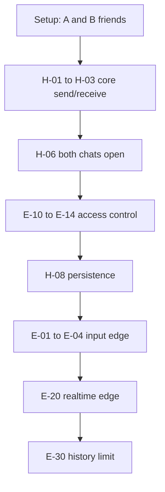

# Chat Test Plan

Scenario-based test plan for verifying two users can chat seamlessly.

## Test objectives

1. Confirm accepted friends can open a shared conversation and exchange messages in real time.
2. Confirm unauthorized users cannot read or write messages.
3. Confirm UI reflects sender vs receiver correctly.
4. Document known gaps (50-msg limit, no error UI) as expected behavior until Phase 1 ships.

## Test environment

| Item | Requirement |
|------|-------------|
| Users | User A, User B — different Google accounts |
| Relationship | Accepted friendship |
| Browsers | Chrome/Edge/Firefox — two profiles or normal + incognito |
| Network | Online; optional offline case for P2 |
| URL | http://localhost:3000 (or staging) |

## Scenario matrix

### Happy path — core messaging (P0)

| ID | Scenario | User A | User B | Expected |
|----|----------|--------|--------|----------|
| H-01 | First message in new thread | Open chat, send "Hello" | Chat open | B sees left-aligned bubble; A sees right-aligned |
| H-02 | Reply | — | Send "Hi back" | A sees new left bubble; B sees right bubble |
| H-03 | Rapid back-and-forth | Send 5 messages quickly | Reply between each | Order preserved; no duplicates; both see full thread |
| H-04 | Long message | Send 500-char message | — | Full text visible in bubble |
| H-05 | Max length | Send 4000-char message | — | Delivered and displayed |
| H-06 | Both chats open | Send while B on chat | B on same `/chat/:id` | B receives without refresh |
| H-07 | Recipient not on chat | Send message | On `/home` only | B opens chat → message present |
| H-08 | Re-open chat | Send, leave, return | — | History persists on reload |
| H-09 | Contact sort | Send last message in thread | — | A's home list shows that contact first |
| H-10 | Special characters | Send `Hello 👋 "quotes" & <tags>` | — | Rendered literally, not broken |

### Happy path — navigation (P1)

| ID | Scenario | Steps | Expected |
|----|----------|-------|----------|
| H-11 | Enter from home | Home → tap contact | Lands on `/chat/:id` with friend name in header |
| H-12 | Header title | Open chat | AppShell title = friend's display name |
| H-13 | Empty thread | New friendship, no messages yet | Empty message area; compose works |
| H-14 | Scroll behavior | 20+ messages in thread | New message auto-scrolls to bottom |

### Edge cases — input validation (P0–P1)

| ID | Scenario | Steps | Expected |
|----|----------|-------|----------|
| E-01 | Empty send | Submit empty or whitespace-only | No message created; input unchanged |
| E-02 | Trim whitespace | Send `  hello  ` | Stored/dispatched as `hello` (trimmed) |
| E-03 | Over max length | Attempt >4000 chars | DB rejects INSERT; no bubble; input behavior per manual check |
| E-04 | Double submit | Double-click Send quickly | Document: may create duplicate messages (known gap) |

### Edge cases — access control (P0)

| ID | Scenario | Steps | Expected |
|----|----------|-------|----------|
| E-10 | Non-participant URL | User C opens `/chat/:id` of A↔B | Redirect to `/home` |
| E-11 | Unauthenticated | Logged out → `/chat/:id` | Redirect to `/login` |
| E-12 | Pending friend | Pending friendship, try INSERT via app if chat reachable | Message insert blocked by RLS |
| E-13 | Invalid conversation ID | `/chat/00000000-0000-0000-0000-000000000000` | Redirect to `/home` |
| E-14 | Blocked friend | Reject request (status=blocked), attempt chat | No accepted friendship → insert fails |

### Edge cases — realtime & sync (P1)

| ID | Scenario | Steps | Expected |
|----|----------|-------|----------|
| E-20 | Tab backgrounded | B backgrounds tab; A sends; B returns | Message visible without manual refresh |
| E-21 | Re-subscribe | B leaves chat, re-enters | New messages since leave appear |
| E-22 | Two tabs same user | A open in two tabs same chat | Both tabs show new messages |
| E-23 | Network blip | Brief offline mid-send | Document actual behavior (likely silent failure) |

### Edge cases — history limit (P1)

| ID | Scenario | Steps | Expected |
|----|----------|-------|----------|
| E-30 | 50+ messages | Seed or send 55 messages | Only last 50 visible on load (known limitation) |
| E-31 | Message 51 | Oldest of 51 not in initial load | Not visible until pagination ships |

### Edge cases — friendship lifecycle (P1)

| ID | Scenario | Steps | Expected |
|----|----------|-------|----------|
| E-40 | Conversation creation | Accept friend request | Conversation auto-created; chat reachable from home |
| E-41 | Same conversation ID | A and B open chat | Both use identical `conversationId` in URL |

## Test execution order

**Minimum release bar:** All **P0** scenarios pass.

## Pass/fail criteria

| Result | Condition |
|--------|-----------|
| **Pass** | Message appears for recipient within 3s, correct alignment, correct order, no data leak |
| **Fail** | Message missing, wrong thread, wrong sender side, unauthorized access, or crash |
| **Known gap** | Documented limitation (e.g. E-30, E-04) — not a fail until Phase 1 fixes |

## Automation candidates (future)

| Scenario | Suggested approach |
|----------|-------------------|
| RLS policies | Supabase local + SQL integration tests |
| `canonicalizeParticipants` | Already in `packages/core` unit tests |
| Message dedup logic | Extract pure function → unit test |
| E2E H-01–H-03 | Playwright two browser contexts |

## Traceability

| Plan area | Scenarios |
|-----------|-----------|
| Realtime delivery | H-01–H-08, E-20–E-22 |
| RLS / security | E-10–E-14 |
| Input validation | E-01–E-03 |
| History | E-30–E-31 → Phase 1 pagination |
| Error handling | E-04, E-23 → Phase 1 optimistic sends |

## Related

- Manual steps: [manual-testing.md](./manual-testing.md)
- Architecture: [architecture.md](./architecture.md)