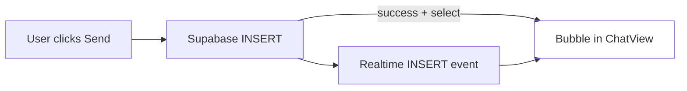

# Chat Troubleshooting & Diagnosis

Diagnosis for: **sender does not see message immediately; receiver does not receive it.**

## Root cause summary

| Layer | Finding | Severity |
|-------|---------|----------|
| **UI architecture** | Sent messages are **not** added from the INSERT response — UI waits only for Realtime `postgres_changes` | **Critical** |
| **Error handling** | INSERT failures are **silent** (no toast, no inline error) | **Critical** |
| **Realtime** | Subscription has **no status callback** — channel errors are invisible | **High** |
| **Realtime auth** | Subscribe runs immediately without waiting for session | **Medium** |
| **Database (env)** | `messages` must be in `supabase_realtime` publication — verify on remote project | **Medium** |
| **RLS** | INSERT requires `friendships.status = 'accepted'` — blocked sends fail silently | **Medium** |

## Symptom → cause map

| What you see | Likely cause |
|--------------|--------------|
| Input **stays** after Send | RLS blocked INSERT (pending/blocked friendship, bad session) |
| Input **clears** but no bubble | INSERT succeeded; Realtime did not deliver event |
| Receiver never sees message (no refresh) | Realtime broken or not subscribed |
| Receiver sees message **after refresh** | INSERT works; Realtime broken |
| Contact taps to `/friends/add` | Accepted friendship but **no conversation row** (trigger gap) |
| Both sides broken from start | Migration not applied, wrong Supabase keys, or project paused |

## Data flow (where it breaks)



**Before fix:** only the `RT --> UI` path existed. If Realtime fails, both sender and receiver see nothing new.

**After fix:** `Insert --> UI` on successful `.select()`; Realtime remains for the other user.

## Verify Supabase dashboard

Run in SQL Editor (project `amxjortnuzqosljwhkpl`):

```sql
-- 1. Realtime publication
SELECT * FROM pg_publication_tables
WHERE pubname = 'supabase_realtime' AND tablename = 'messages';

-- 2. Friendship + conversation for two users
SELECT f.status, c.id AS conversation_id
FROM friendships f
LEFT JOIN conversations c ON
  c.user_a_id = LEAST(f.requester_id, f.addressee_id)
  AND c.user_b_id = GREATEST(f.requester_id, f.addressee_id)
WHERE f.requester_id = $USER_A AND f.addressee_id = $USER_B;

-- 3. Recent messages
SELECT id, sender_id, body, created_at
FROM messages
ORDER BY created_at DESC
LIMIT 10;
```

**Dashboard checks:**
- Database → Publications → `supabase_realtime` → `messages` enabled
- Settings → API → publishable key matches `NEXT_PUBLIC_SUPABASE_ANON_KEY`
- Project not paused

## Browser DevTools checks

1. **Network → Fetch/XHR** — on Send, look for `POST .../rest/v1/messages`
   - `201` = insert OK
   - `401` = session expired
   - `403` / policy error = RLS blocked

2. **Network → WS** — connection to `wss://*.supabase.co/realtime/v1`
   - Should show active WebSocket while chat is open

3. **Console** — after fix, `[chat] realtime subscribed` or `[chat] realtime failed`

## Fix plan (implemented)

### P0 — `chat-view.tsx` (done)

1. `.insert().select().single()` — append returned row to `messages` immediately
2. Show `sendError` inline when INSERT fails
3. Subscribe after `getSession()`; log channel status
4. Disable Send while request in flight

### P1 — follow-up

- [ ] Toast component for errors
- [ ] Re-subscribe on `TOKEN_REFRESHED`
- [ ] `page.tsx` — surface message load errors
- [ ] Backfill conversations for accepted friendships missing rows
- [ ] Migration `REPLICA IDENTITY FULL` on `messages` if filtered realtime still flaky

### P1 — Supabase ops

- [ ] Confirm migration `20250625000001_initial_schema.sql` applied on remote
- [ ] Confirm `messages` in realtime publication

## Re-test after fix

Run [manual-testing.md](./manual-testing.md) **HP-1** and **HP-2**:

- Sender must see bubble **immediately** after Send (without refresh)
- Receiver must see bubble within ~3s without refresh

## Related

- [architecture.md](./architecture.md)
- [test-plan.md](./test-plan.md)
- [../../features/realtime-chat.md](../../features/realtime-chat.md)