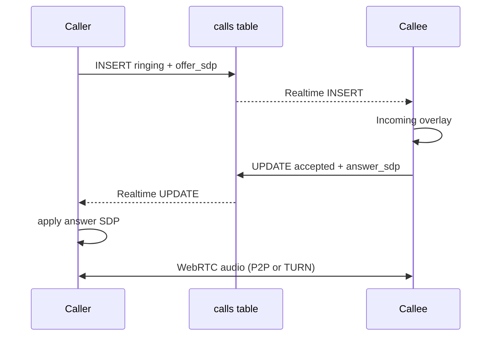

# Audio Calls

1-on-1 voice calls between accepted friends using WebRTC with Supabase Postgres signaling.

## User flow

## UI

| Location | Behavior |
|----------|----------|
| Chat header | Phone button starts call (friends only) |
| `CallOverlay` | Full-screen incoming / outgoing / in-call controls |
| Mute / hang up | Available while connected |

## File map

| File | Role |
|------|------|
| `supabase/migrations/20250628150001_audio_calls.sql` | `calls` table, RLS, Realtime |
| `packages/core/src/call-types.ts` | Shared call types |
| `apps/web/src/lib/calls/peer-session.ts` | WebRTC peer connection |
| `apps/web/src/lib/calls/call-db.ts` | Insert / accept / end call rows |
| `apps/web/src/contexts/call-context.tsx` | Global call state + Realtime |
| `apps/web/src/components/calls/call-overlay.tsx` | Call UI |
| `apps/web/src/app/api/turn/route.ts` | ICE servers (STUN + optional TURN) |

## Signaling

- Full SDP gathered before persist (no trickle ICE)
- `offer_sdp` written by caller on INSERT
- `answer_sdp` written by callee on accept UPDATE
- Terminal statuses: `ended`, `rejected`, `missed` (45s ring timeout)

## TURN

Set `METERED_TURN_API_KEY` for NAT traversal in production. Without it, only public Google STUN is used (may fail across strict NAT).

## Out of scope

- Video
- Call history UI
- Push notifications for background incoming calls