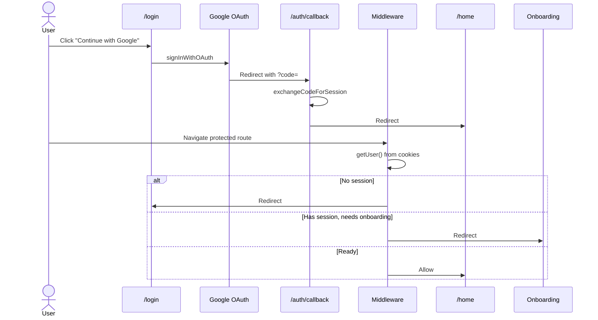

# Authentication

Google OAuth sign-in with Supabase Auth, cookie-based sessions, and middleware route guards.

## User flow

## Behavior

| Scenario | Result |
|----------|--------|
| Unauthenticated user visits `/home`, `/chat/*`, `/friends/*`, `/settings` | Redirect to `/login` |
| Authenticated user visits `/login` or `/auth/*` | Redirect to `/home` |
| Authenticated user without `public_id` or `display_name` visits protected route | Redirect to `/onboarding` |
| Authenticated user with complete profile visits `/onboarding` | Redirect to `/home` |
| Root `/` | Redirect to `/home` if logged in, else `/login` |

## File map

| File | Role |
|------|------|
| `apps/web/src/app/login/page.tsx` | Login landing page |
| `apps/web/src/app/login/login-button.tsx` | Triggers `signInWithOAuth({ provider: "google" })` |
| `apps/web/src/app/auth/callback/route.ts` | Exchanges OAuth code for session |
| `apps/web/src/middleware.ts` | Entry point; delegates to session updater |
| `apps/web/src/lib/supabase/middleware.ts` | Session refresh + route guard logic |
| `apps/web/src/lib/supabase/server.ts` | Server-side Supabase client (cookies) |
| `apps/web/src/lib/supabase/client.ts` | Browser Supabase client |
| `apps/web/src/app/page.tsx` | Root redirect |
| `apps/web/src/app/(app)/layout.tsx` | Secondary auth check; redirects if no user |

## Supabase configuration

1. Enable **Google** provider in Supabase Dashboard → Authentication → Providers.
2. Add redirect URL: `http://localhost:3000/auth/callback` (and production URL).
3. OAuth redirect target in code: `${window.location.origin}/auth/callback`.

## Session handling

- Uses `@supabase/ssr` with cookie read/write in middleware.
- Middleware runs on all routes except static assets (`_next/static`, images, favicon).
- Server components use `createClient()` from `@/lib/supabase/server`.
- Client components use `createClient()` from `@/lib/supabase/client`.

## Auth callback

`GET /auth/callback?code=...&next=/home`

- Exchanges `code` via `supabase.auth.exchangeCodeForSession(code)`.
- On success: redirect to `next` param (default `/home`).
- On failure: redirect to `/login?error=auth`.

## Security notes

- No custom JWT handling — Supabase manages tokens in HTTP-only cookies.
- All data access is further restricted by Postgres RLS (see [data-model-and-security.md](./data-model-and-security.md)).
- `SUPABASE_SERVICE_ROLE_KEY` is never exposed to the client.

## Extension hooks

| Future need | Suggested approach |
|-------------|-------------------|
| Additional OAuth providers | Add buttons calling `signInWithOAuth` with other providers |
| Email/password auth | Enable in Supabase; add login form + `signInWithPassword` |
| Session expiry UX | Listen to `onAuthStateChange` in a client provider; show re-login prompt |
| Account deletion | New API route + cascade via `auth.users` FK on `profiles` |