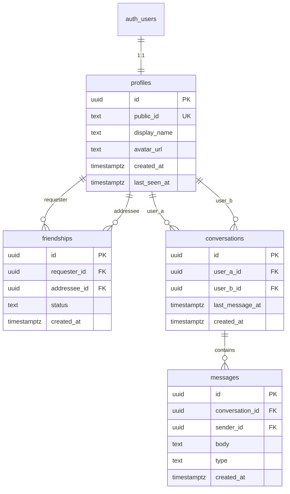

# Data Model & Security

Postgres schema, triggers, row-level security, and realtime configuration.

## Entity relationship

## Tables

### `profiles`

| Column | Type | Notes |
|--------|------|-------|
| `id` | uuid PK | References `auth.users(id)` ON DELETE CASCADE |
| `public_id` | text UNIQUE | Set at onboarding |
| `display_name` | text | 2–32 chars at API layer |
| `avatar_url` | text | Unused in app |
| `created_at` | timestamptz | Default `now()` |
| `last_seen_at` | timestamptz | Unused in app |

**Index:** `profiles_public_id_idx`

### `friendships`

| Column | Type | Notes |
|--------|------|-------|
| `id` | uuid PK | `gen_random_uuid()` |
| `requester_id` | uuid FK → profiles | Who sent the request |
| `addressee_id` | uuid FK → profiles | Who receives it |
| `status` | text | `pending`, `accepted`, `blocked` |
| `created_at` | timestamptz | Default `now()` |

**Constraints:**
- `friendships_no_self`: requester ≠ addressee
- `friendships_unique_pair`: unique `(requester_id, addressee_id)`

**Indexes:** `friendships_addressee_idx`, `friendships_requester_idx`

### `conversations`

| Column | Type | Notes |
|--------|------|-------|
| `id` | uuid PK | |
| `user_a_id` | uuid FK | Lower UUID of pair |
| `user_b_id` | uuid FK | Higher UUID of pair |
| `last_message_at` | timestamptz | Updated by trigger |
| `created_at` | timestamptz | |

**Constraints:**
- `conversations_ordered`: `user_a_id < user_b_id`
- `conversations_unique_pair`: unique `(user_a_id, user_b_id)`

### `messages`

| Column | Type | Notes |
|--------|------|-------|
| `id` | uuid PK | |
| `conversation_id` | uuid FK | ON DELETE CASCADE |
| `sender_id` | uuid FK | Must equal `auth.uid()` on insert |
| `body` | text | 1–4000 chars |
| `type` | text | `'text'` only |
| `created_at` | timestamptz | |

**Index:** `messages_conversation_created_idx (conversation_id, created_at DESC)`

## Triggers

| Trigger | Event | Function | Effect |
|---------|-------|----------|--------|
| `on_auth_user_created` | INSERT on `auth.users` | `handle_new_user()` | Creates stub profile |
| `on_friendship_accepted` | INSERT/UPDATE on `friendships` | `handle_friendship_accepted()` | Creates conversation when status → `accepted` |
| `on_message_created` | INSERT on `messages` | `handle_new_message()` | Sets `conversations.last_message_at` |

## Row-level security

All tables have RLS enabled.

### `profiles`

| Policy | Operation | Rule |
|--------|-----------|------|
| `profiles_select_authenticated` | SELECT | Any authenticated user |
| `profiles_update_own` | UPDATE | `auth.uid() = id` |

### `friendships`

| Policy | Operation | Rule |
|--------|-----------|------|
| `friendships_select_own` | SELECT | User is requester or addressee |
| `friendships_insert_requester` | INSERT | `auth.uid() = requester_id` |
| `friendships_update_participant` | UPDATE | User is participant |

### `conversations`

| Policy | Operation | Rule |
|--------|-----------|------|
| `conversations_select_participant` | SELECT | User is `user_a_id` or `user_b_id` |

No INSERT policy for clients — conversations created only by trigger (security definer).

### `messages`

| Policy | Operation | Rule |
|--------|-----------|------|
| `messages_select_participant` | SELECT | User in parent conversation |
| `messages_insert_participant` | INSERT | User is sender, in conversation, and friendship is `accepted` |

## Realtime publication

Tables in `supabase_realtime`:
- `messages` — actively used by chat

## Migrations

| File | Purpose |
|------|---------|
| `20250625000001_initial_schema.sql` | Full schema, triggers, RLS, realtime |
| `20250625000002_realtime_calls.sql` | Historical — calls realtime (superseded by 004) |
| `20250625000003_call_signaling.sql` | Historical — SDP columns on calls (superseded by 004) |
| `20250627000001_drop_calls.sql` | Drops legacy `calls` table and removes from realtime |

**New deployments:** Run all migrations in order. Migration 004 removes the `calls` artifacts created by 001–003.

## Canonical participant ordering

Always store conversation pairs with `user_a_id < user_b_id` (UUID string comparison).

Utility: `canonicalizeParticipants()` in `packages/core/src/conversation.ts`.

Used by:
- DB trigger `handle_friendship_accepted`
- Home page conversation lookup

## Planned schema (Phase 2)

| Addition | Plan |
|----------|------|
| `blocks` table (directional block) | [remove-and-block-friends.md](../plans/phase2/remove-and-block-friends.md) |
| Storage bucket `avatars` + `profiles.avatar_url` | [profile-pictures.md](../plans/phase2/profile-pictures.md) |
| `last_seen_at` | Unused — [disable-presence.md](../plans/phase2/disable-presence.md) |

## Security checklist for new tables

- [ ] `ENABLE ROW LEVEL SECURITY`
- [ ] SELECT policy scoped to participants
- [ ] INSERT policy validates `auth.uid()`
- [ ] UPDATE/DELETE policies prevent cross-user mutation
- [ ] FK cascades defined explicitly
- [ ] Add to realtime publication only if client needs live updates