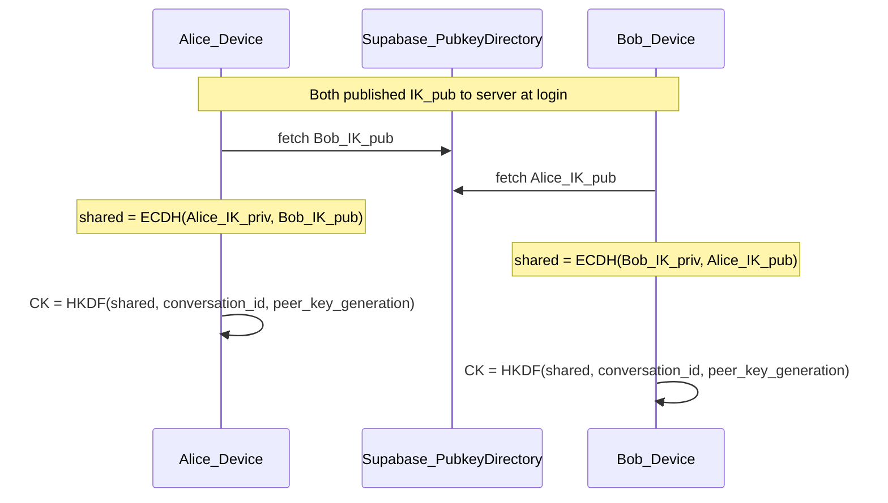
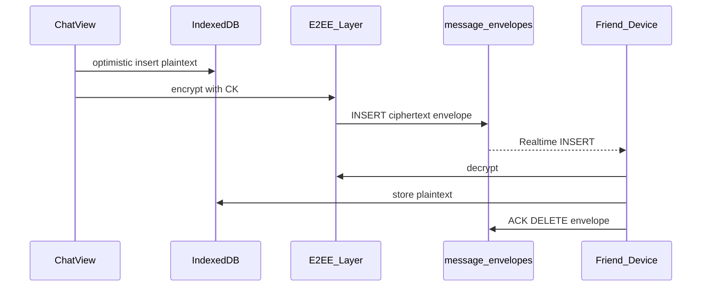
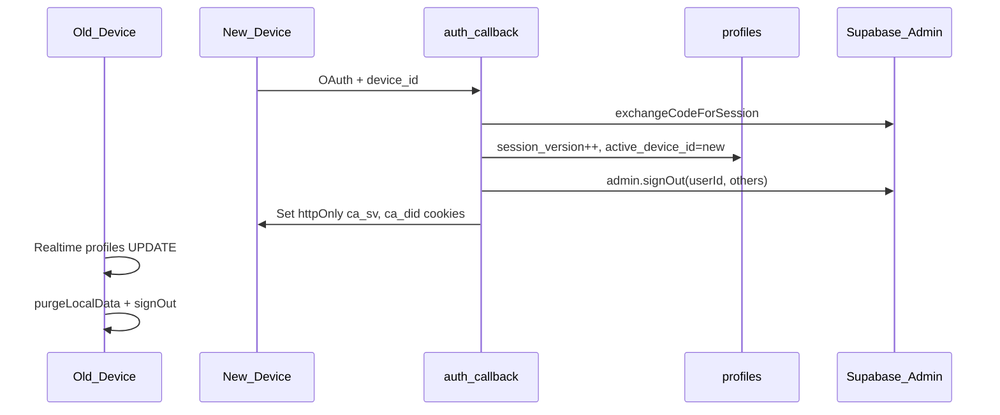

# E2EE Local Chat

End-to-end encrypted 1-on-1 messaging where decrypted history lives only on the active device. The server relays short-lived ciphertext envelopes and stores public keys — it cannot read message bodies.

**Implementation plan:** [apps/e2e/PLAN.md](../../apps/e2e/PLAN.md) · **Task breakdown:** [apps/e2e/tasks/README.md](../../apps/e2e/tasks/README.md) · **End-to-end journey (friend request → first message):** [e2ee-friend-to-message-journey.md](../feature-tests/chat/e2ee-friend-to-message-journey.md)

> **Status (June 2026):** Core crypto, IndexedDB vault, encrypted relay library, and partial single-device session plumbing are shipped. UI rewire, full session enforcement, and encrypted images are still pending. Production chat still reads/writes plaintext `messages` until task 05 lands.

---

## Overview

| Aspect | v1 target | Today |
|--------|-----------|-------|
| Message plaintext | IndexedDB vault on active device | Still in Postgres `messages.body` (legacy path) |
| Server role | Public key directory + ciphertext relay | Schema + relay libs exist; UI not wired |
| History source of truth | Active device | Server (until UI rewire) |
| Images | Client-encrypted, 24h server TTL | Legacy public `chat-media` URLs |
| Multi-device | Deferred to v2 | Single-device libs partial |

### Product contract (v1)

| Rule | Behavior |
|------|----------|
| Single active device | New login succeeds; old device revokes session and wipes local vault |
| History on device | Decrypted messages only in IndexedDB |
| Logout | Wipe IndexedDB + crypto keys + sign out |
| New device | Empty vault; `key_generation++`; friends re-run ECDH with new pubkey |
| Images | Client-encrypted blobs on server; auto-deleted after 24h |
| Server relay | Ciphertext envelopes only (7-day TTL, deleted on ACK) — not history |
| No legacy import | Purge migration deletes all server plaintext messages |

---

## Threat model

### Protected against

| Threat | How |
|--------|-----|
| Database breach / curious admin | Server stores ciphertext envelopes and pubkeys only — no `IK_priv`, no `CK`, no `AK` |
| Passive network observer on relay | Envelope payloads are AES-256-GCM ciphertext |

### Not protected against (v1)

| Threat | Notes |
|--------|-------|
| XSS on the web app | Attacker can read `IK_priv` and vault contents from IndexedDB |
| Metadata analysis | Timestamps, envelope sizes, social graph, conversation IDs visible server-side |
| MITM without safety numbers | TOFU pins pubkey on first exchange; no out-of-band verification UI yet |
| Device loss without backup | No vault export or encrypted backup in v1 |
| Peer retaining history | Recipient keeps local copy after sender deletes/hides |
| Forward secrecy | Static conversation key (`CK`) per peer `key_generation` — compromise of `CK` reveals all messages in that generation |

Document these limitations honestly in release notes and support docs.

---

## Cryptography

### Key material

| Key | Server? | Device? | Purpose |
|-----|---------|---------|---------|
| Identity private (`IK_priv`) | **No** | IndexedDB `device_identity` | ECDH key agreement |
| Identity public (`IK_pub`) | **Yes** — `user_crypto_keys` | IndexedDB copy | Peers fetch to run ECDH |
| Conversation key (`CK`) | **No** | IndexedDB `crypto_material` | Encrypt/decrypt messages |
| Attachment key (`AK`) | **No** | Inside encrypted message payload | Per-image encryption |
| Shared DH secret | **No** | Never stored | Used once to derive `CK` |

### Key agreement (X25519 + HKDF)



**Derivation:**

```
shared = X25519(my_IK_priv, peer_IK_pub)
CK = HKDF-SHA256(shared, salt=conversation_id, info="callingapp-ck-v1-{peer_key_generation}")
```

**Per message:**

```
nonce = random 12 bytes
AAD = conversationId || senderId || messageId || type || senderKeyGeneration
ciphertext = AES-256-GCM(CK, nonce, plaintext, AAD)
```

**Library:** Web Crypto API (`X25519`, `HKDF-SHA256`, `AES-256-GCM`). Code in `packages/core/src/crypto/`.

### Trust model

- **TOFU:** First key exchange pins peer pubkey in vault `trusted_pubkeys`.
- **Key rotation:** `sender_key_generation` on envelopes; multiple `CK` versions cached per conversation.
- **"Security code changed"** banner when peer `key_generation` bumps — *planned, not yet in UI*.

### Send flow



---

## Local storage (IndexedDB vault)

Database name: `callingapp-vault-{userId}`. Wiped on logout and session replace.

| Store | Contents |
|-------|----------|
| `device_identity` | `IK_priv`, local `IK_pub`, `keyGeneration` |
| `crypto_material` | `CK` per `(conversationId, peerKeyGeneration)` |
| `trusted_pubkeys` | TOFU-pinned friend pubkeys |
| `messages` | Decrypted history, indexed `[conversationId+createdAt]` |
| `conversations` | Sidebar: preview, unread, `lastReadAt` |
| `outbox` | Pending encrypted envelopes (retry queue) |
| `attachments_cache` | Decrypted image blobs (LRU) |
| `message_hides` | Local-only hide flags |

**Source of truth (target):** IndexedDB. React state is a view over the vault.

### File map — vault

| File | Role |
|------|------|
| `apps/web/src/lib/vault/schema.ts` | Dexie schema and row types |
| `apps/web/src/lib/vault/store.ts` | `openVault`, CRUD helpers, pagination |
| `apps/web/src/lib/vault/wipe.ts` | `wipeVault(userId)` — deletes entire DB |
| `apps/web/src/lib/vault/index.ts` | Public exports |

---

## Server schema

Migration: `supabase/migrations/20250628150001_e2ee_schema.sql`

| Table / object | Purpose |
|----------------|---------|
| `user_crypto_keys` | `IK_pub` + `key_generation` per user |
| `message_envelopes` | Ciphertext relay (7-day TTL); Realtime publication |
| `message_attachments` | Encrypted blob metadata (24h TTL) |
| `profiles.session_version` | Single-device session counter |
| `profiles.active_device_id` | Currently registered device |
| `chat-media-private` | Private storage bucket (API-only access) |

Legacy purge: `supabase/migrations/20250628150002_e2ee_purge_legacy.sql` deletes all `messages` rows and deprecates `latest_message_previews`.

### File map — relay

| File | Role |
|------|------|
| `apps/web/src/lib/e2ee/envelope.ts` | Row types, `bytea` parse/serialize |
| `apps/web/src/lib/e2ee/key-exchange.ts` | Fetch peer pubkey, ECDH, cache `CK`, TOFU pin |
| `apps/web/src/lib/e2ee/send.ts` | Encrypt text → insert envelope → local vault |
| `apps/web/src/lib/e2ee/receive.ts` | Decrypt envelope → vault → ACK delete |
| `apps/web/src/lib/e2ee/attachment.ts` | Per-image `AK` encrypt/decrypt helpers |

### File map — crypto core

| File | Role |
|------|------|
| `packages/core/src/crypto/identity.ts` | X25519 keypair generate/import/export |
| `packages/core/src/crypto/conversation-key.ts` | ECDH + HKDF → AES-GCM key |
| `packages/core/src/crypto/message.ts` | `buildAad`, encrypt/decrypt |
| `packages/core/src/crypto/crypto.test.ts` | Roundtrip and determinism tests |

---

## Single-device session



| Layer | Implementation | Status |
|-------|----------------|--------|
| Device ID | `crypto.randomUUID()` in `localStorage` (`callingapp:device_id`) | Shipped |
| Realtime kick | `createSessionListener` on `profiles` UPDATE | Shipped |
| Session replace handler | `purgeLocalData` + `signOut` + redirect | Shipped |
| Logout wipe | `settings-dialog.tsx` calls `purgeLocalData` | Shipped |
| Auth callback bump | `auth/callback/route.ts` sets `session_version`, cookies | **Pending** |
| Middleware cookie gate | Compare `ca_sv` / `ca_did` to profile | **Pending** |
| Session API | `GET /api/auth/session` | **Pending** |

**Pitfall:** JWT may remain valid ~1h after revoke. Cookie gate is mandatory when implemented.

### File map — session

| File | Role |
|------|------|
| `apps/web/src/lib/device-id.ts` | `getOrCreateDeviceId()` |
| `apps/web/src/lib/session/listener.ts` | Realtime `profiles` subscription |
| `apps/web/src/lib/session/purge.ts` | `purgeLocalData`, `handleSessionReplaced` |
| `apps/web/src/components/session/session-guard.tsx` | Mounts listener in app layout |

---

## Images (client E2EE, 24h server TTL)

1. Compress image client-side (reuse `compress-image.ts`)
2. Generate random `AK`; encrypt bytes with AES-GCM (`attachment.ts`)
3. Upload ciphertext via `POST /api/chat/attachments`
4. Send envelope with encrypted `{ ak, attachmentId, mime }` inside message ciphertext
5. Recipient decrypts → caches in `attachments_cache`
6. Cron deletes expired blobs; UI shows "Image expired"

| Piece | Status |
|-------|--------|
| `encryptAttachmentBytes` / `decryptAttachmentBytes` | Shipped |
| Upload API (`/api/chat/attachments`) | Stub (501) |
| Download API | **Pending** |
| Send/receive image via envelopes | **Pending** |
| Cron cleanup | **Pending** |

---

## Implementation status

| Task | Area | Status |
|------|------|--------|
| 00 | Schema + legacy purge migrations | **Partial** — SQL shipped; manual `chat-media` bucket empty is operational |
| 01 | Crypto module (`packages/core`) | **Done** |
| 02 | IndexedDB vault | **Done** — live-query subscriptions and outbox helpers pending |
| 03 | Single-device session | **Partial** — listener + purge shipped; auth callback + middleware pending |
| 04 | Encrypted relay libs | **Partial** — send/receive/key-exchange shipped; outbox, offline catch-up, identity publish pending |
| 05 | UI rewire (vault-first chat) | **Pending** |
| 06 | Encrypted images + cron | **Partial** — crypto helpers only |
| 07 | Architecture docs | **In progress** |

### What works today (library level)

- X25519 identity keys, ECDH, HKDF conversation keys, AES-GCM message encrypt/decrypt (unit tested).
- Dexie vault with message pagination, identity/CK storage, TOFU pubkey pins, wipe on logout.
- `sendEncryptedText` and `processEnvelope` roundtrip against `message_envelopes` (not yet called from `ChatView`).
- Session Realtime listener kicks replaced devices when `active_device_id` changes (requires server to bump the field).

### What is still pending

- Wire `ChatView`, `ContactsProvider`, and sidebar to vault + E2EE relay (task 05).
- Publish `IK_pub` to `user_crypto_keys` on first vault open / new device.
- Offline envelope catch-up on app open; outbox retry for failed sends.
- Full auth callback + middleware session gate.
- Encrypted image upload/download APIs and cron cleanup.
- "Security code changed" UI; decrypt-failure placeholder bubbles.

---

## Deferred features (v2+)

| Feature | v1 handling |
|---------|-------------|
| Multi-device login | Single `IK_pub` per user; new login revokes old device |
| History sync / backup | None — empty vault on new device |
| Group chat E2EE | Deferred |
| Forward secrecy (Double Ratchet) | Static `CK` per key generation |
| Safety numbers / QR verify | TOFU only |
| Server link previews | Disable or client-side post-decrypt |
| Push with message body | Generic "New message" only |
| Global soft-delete | Local-only hide or encrypted tombstone (TBD) |

### v2 extension path

| v1 | v2 extension |
|----|--------------|
| One `IK_pub` per user | `user_devices` table: one pubkey per device |
| `active_device_id` on profile | N registered devices; remove-device UX |
| One envelope per recipient | Fan-out per recipient device |
| No history sync | Encrypted vault backup (passphrase) or QR transfer |

Design rules preserved for v2: never derive `IK` from OAuth tokens; keep `sender_key_generation` on envelopes; abstract `getPeerPublicKeys(userId)`.

---

## v1 limitations (explicit)

1. **No forward secrecy** — static `CK` until peer rotates `key_generation`.
2. **No multi-device** — one active device; others wiped.
3. **No backup** — logout or new device = empty history.
4. **No MITM protection** without future safety-number UX.
5. **Metadata visible** to server and Supabase operators.
6. **Images ephemeral server-side** — text permanent local; server blobs expire in 24h.
7. **JWT lag** — up to ~1h valid JWT after session revoke until cookie gate ships.

---

## Testing

Manual E2EE test checklist: [feature-tests/e2ee/manual-testing.md](../feature-tests/e2ee/manual-testing.md)

Unit tests:

```bash
pnpm test    # packages/core crypto + apps/web vault store
```

---

## Related docs

- Legacy plaintext chat (pre-E2EE UI): [realtime-chat.md](./realtime-chat.md) — superseded for message bodies once task 05 ships
- Schema and RLS: [data-model-and-security.md](./data-model-and-security.md)
- Full plan: [apps/e2e/PLAN.md](../../apps/e2e/PLAN.md)