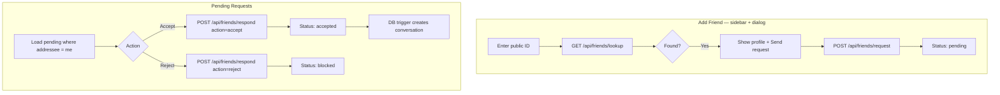

# Friends

Add contacts by public ID, send requests, and accept or reject incoming requests.

## User flow



## Friendship states

| Status | Meaning | Who can set |
|--------|---------|-------------|
| `pending` | Request sent, awaiting response | Insert on request |
| `accepted` | Mutual contact; can chat | Addressee via accept |
| `blocked` | Legacy: rejected request (to be replaced) | Addressee via reject |
| `declined` | *(planned)* Rejected request | Addressee via reject |

**Note:** Reject currently sets `blocked`, which will be separated from user-initiated **block** (see plan). Remove and block flows are not built yet.

### Planned: Remove vs block

| Action | Lookup | Messaging |
|--------|--------|-----------|
| **Remove friend** | Removed user can still find you by public ID | Only after re-accepted |
| **Block friend** | Blocked user cannot find you at all | Never while blocked |

See [remove-and-block-friends.md](../plans/phase2/remove-and-block-friends.md).

## Constraints

- Cannot add yourself (`lookup` returns 400).
- One friendship row per ordered pair (`unique(requester_id, addressee_id)`).
- Requester must be the authenticated user on insert (RLS + API).
- Only the addressee can accept/reject a pending request.

## File map

| File | Role |
|------|------|
| `apps/web/src/components/friends/add-friend-dialog.tsx` | Modal: lookup + send request |
| `apps/web/src/components/friends/pending-requests-panel.tsx` | Incoming pending list (inside dialog) |
| `apps/web/src/components/messages/sidebar-chrome.tsx` | `+` button opens dialog; `?addFriend=1` deep link |
| `apps/web/src/app/(app)/friends/add/page.tsx` | Redirect → `/home?addFriend=1` |
| `apps/web/src/app/api/friends/lookup/route.ts` | Find user by public ID |
| `apps/web/src/app/api/friends/request/route.ts` | Create pending friendship |
| `apps/web/src/app/api/friends/respond/route.ts` | Accept or reject |
| `apps/web/src/lib/friends.ts` | Shared TypeScript interfaces |

## API: GET `/api/friends/lookup?publicId=CA7K9M2X`

**Auth:** Required

**Response (200):**
```json
{
  "profile": {
    "id": "uuid",
    "public_id": "CA7K9M2X",
    "display_name": "Alex",
    "avatar_url": null
  },
  "friendship": { "id": "uuid", "status": "pending" }
}
```

`friendship` is `null` if no existing relationship.

**Errors:** 400 (invalid format, self-lookup), 401, 404 (user not found)

## API: POST `/api/friends/request`

**Request:**
```json
{ "targetUserId": "uuid" }
```

**Response (200):**
```json
{ "friendshipId": "uuid" }
```

**Errors:** 400 (invalid target), 401, 409 (friendship already exists)

## API: POST `/api/friends/respond`

**Request:**
```json
{ "friendshipId": "uuid", "action": "accept" }
```

`action` is `"accept"` or `"reject"`.

**Response (200):**
```json
{ "ok": true, "status": "accepted" }
```

**Errors:** 400, 401, 403 (not addressee), 409 (already handled)

## Conversation auto-creation

When friendship status transitions to `accepted`, trigger `handle_friendship_accepted()`:

1. Canonicalize participant UUIDs (`user_a_id < user_b_id`).
2. `INSERT INTO conversations` with `ON CONFLICT DO NOTHING`.

See [data-model-and-security.md](./data-model-and-security.md).

## RLS summary

| Operation | Rule |
|-----------|------|
| SELECT | Participant in friendship |
| INSERT | `auth.uid() = requester_id` |
| UPDATE | Participant in friendship |

## Extension hooks

| Future need | See plan |
|-------------|----------|
| Remove friend | [remove-and-block-friends.md](../plans/phase2/remove-and-block-friends.md) |
| Block / unblock | [remove-and-block-friends.md](../plans/phase2/remove-and-block-friends.md) |
| Outgoing request list | Query `status=pending` where `requester_id = me` |
| Realtime pending notifications | Subscribe to `friendships` INSERT where `addressee_id = me` |
| E2EE key exchange after accept | See [e2ee-friend-to-message-journey.md](../feature-tests/chat/e2ee-friend-to-message-journey.md) — **no crypto on request/accept**; keys exchanged lazily on first chat open |