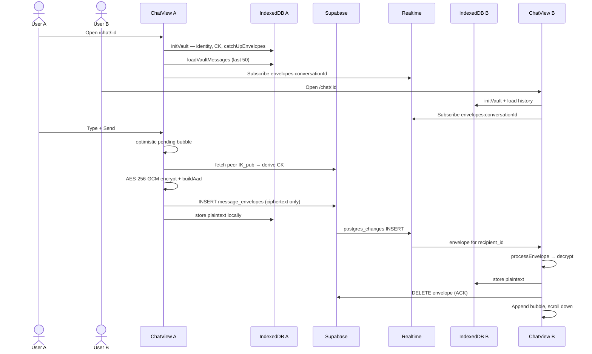
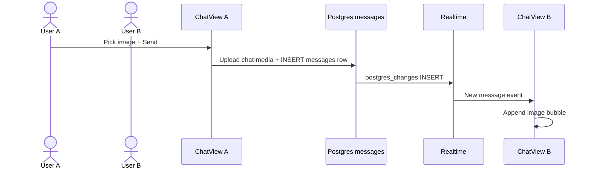

# Realtime Chat

1-on-1 text and image messaging between accepted friends with live delivery via Supabase Realtime.

> **E2EE (text):** Text messages use `message_envelopes` + IndexedDB vault — see [e2ee-local-chat.md](./e2ee-local-chat.md). **Images** still use legacy plaintext `messages` + public `chat-media` until encrypted attachments ship.

## User flow — text (E2EE)



## User flow — images (legacy)



## Access control

Messaging requires **all** of:

1. User is a participant in the conversation (`user_a_id` or `user_b_id`).
2. An `accepted` friendship exists between the two participants.
3. `sender_id` equals `auth.uid()` on insert.

Enforced by RLS policy `messages_insert_participant` — see [data-model-and-security.md](./data-model-and-security.md).

## Message constraints

| Field | Constraint |
|-------|------------|
| `body` | 1–4000 characters for `text`; empty for `image` |
| `type` | `"text"` or `"image"` |
| `attachment_url` | Required when `type` is `"image"` (public `chat-media` URL) |
| `conversation_id` | Must reference existing conversation |
| `sender_id` | Must be current user |

**Image uploads:** Client compresses picks to ≤1 MB (max 1920px edge) via `browser-image-compression`, then uploads to `chat-media/{conversationId}/{uuid}.ext`. Home preview shows `[Image]`.

**Link previews:** Text messages containing `http://` or `https://` URLs render a preview card (OG metadata via `/api/link-preview`, cached in `localStorage` only). YouTube links show `img.youtube.com` thumbnails immediately. Tapping the card opens an in-app browser dialog with iframe embed (YouTube URLs use `/embed/`).

## File map

| File | Role |
|------|------|
| `apps/web/src/app/(app)/chat/[id]/page.tsx` | SSR: load conversation, verify participant, fetch last 50 messages |
| `apps/web/src/app/(app)/chat/[id]/chat-view.tsx` | Client: realtime subscription, pagination, send form, bubble UI |
| `apps/web/src/lib/chat/messages.ts` | `fetchOlderMessages()` cursor pagination helper |
| `apps/web/src/lib/chat/remove-message.ts` | Global soft remove (own messages) |
| `apps/web/src/lib/chat/hide-message.ts` | Per-user hide (others' messages) |
| `apps/web/src/lib/chat/message-hides.ts` | Load hidden message IDs for a conversation |
| `apps/web/src/components/chat/message-actions-menu.tsx` | Delete / hide action on bubbles |
| `apps/web/src/lib/chat/optimistic.ts` | Pending/confirmed message state helpers |
| `apps/web/src/lib/chat/compress-image.ts` | Client-side downscale/compress to ≤1 MB |
| `apps/web/src/lib/chat/upload-image.ts` | Upload compressed blob to `chat-media` |
| `apps/web/src/components/chat/link-preview-card.tsx` | Rich link preview card in message thread |
| `apps/web/src/components/chat/link-preview-dialog.tsx` | In-app browser dialog (iframe) |
| `apps/web/src/lib/chat/detect-links.ts` | Extract URLs from message body |
| `apps/web/src/lib/chat/link-preview.ts` | OG parse helpers, YouTube thumbnail URL, embed URL |
| `apps/web/src/lib/chat/link-preview-cache.ts` | `localStorage` cache for preview metadata (7-day TTL) |
| `apps/web/src/app/api/link-preview/route.ts` | Server-side OG metadata fetch |
| `apps/web/src/components/chat/compose-bar.tsx` | Compose bar with emoji picker + image picker |
| `apps/web/src/components/chat/emoji-picker-popover.tsx` | Emoji picker popover |
| `packages/core/src/types.ts` | `Message`, `MessageType` interfaces |
| `supabase/migrations/20250625000001_initial_schema.sql` | `messages` table, RLS, realtime publication |

## Page: `/chat/[id]`

**Server-side checks:**
1. User authenticated (redirect `/login`).
2. Conversation exists and user is participant (else redirect `/home`).
3. Resolve friend profile for header title.
4. Fetch up to **50** most recent messages (descending query, reversed for display).

**Renders:** `AppShell` + `ChatView` with `initialMessages`.

## ChatView component

**State:**
- `messages` — initialized from SSR, prepended via pagination, appended via realtime
- `hasMore` / `loadingOlder` — cursor pagination for older history
- `body` — compose input text

**Realtime subscription (text):**
```typescript
supabase.channel(`envelopes:${conversationId}`)
  .on("postgres_changes", {
    event: "INSERT",
    schema: "public",
    table: "message_envelopes",
    filter: `conversation_id=eq.${conversationId}`,
  }, async (payload) => {
    if (payload.new.recipient_id !== currentUserId) return;
    const result = await processEnvelope(supabase, vault, payload.new);
    // append decrypted message to UI
  })
```

Image sends still `INSERT` into `messages` and may use a separate legacy subscription path where applicable.

**Deduplication:** Before appending, checks `prev.some(m => m.id === row.id)`.

**Remove / hide:**
- Any participant can act on any message via `⋯` menu.
- **Own message:** `UPDATE` sets `removed_at` + clears `body`; both users see muted **"Message removed"** bubble (realtime UPDATE).
- **Other's message:** `INSERT message_hides`; hidden only for the actor (filtered on SSR load and pagination).

**Send text (optimistic + E2EE):** On submit, appends a pending bubble and clears compose. `sendEncryptedText` derives `CK`, encrypts with AES-256-GCM, `INSERT`s into `message_envelopes` (insert-only — no `.select()`), then saves plaintext to IndexedDB and confirms the bubble. Failed sends show "Failed to send · Retry".

**Send image (legacy):** Compresses, uploads to `chat-media`, `INSERT`s plaintext `messages` row with public URL.

**Realtime:** Subscribes after `getSession()`; logs channel status; banner if not `SUBSCRIBED`.

**Pagination:** "Load older messages" at top fetches 30 more via `fetchOlderMessages()` using `(created_at, id)` cursor. Scroll position preserved when prepending. `hasMore` is false when a page returns fewer than 30 rows.

**UI:**
- Mine: right-aligned coral bubble with timestamp below
- Theirs: left-aligned surface bubble with timestamp below
- Day separators between message groups
- Emoji picker in compose bar (UTF-8 in `body`, no schema change)
- Auto-scroll to bottom on new messages only (not when loading older)

## Conversation metadata

Trigger `handle_new_message()` updates `conversations.last_message_at` on every INSERT. Used by [contacts-home.md](./contacts-home.md) for sorting.

## Realtime publication

`messages` table is in `supabase_realtime` publication (migration 001).

## Known limitations

| Limitation | Plan |
|------------|------|
| No typing indicators | [typing-indicators.md](../plans/phase3/typing-indicators.md) (Phase 3) |
| Unread badges / read state | [unread-and-read-state.md](../plans/phase3/unread-and-read-state.md) — `conversation_reads` + sidebar badges |
| No attachments | [message-enhancements.md](../plans/phase1/message-enhancements.md) |
| No edit / forward | [message-edit.md](../plans/phase3/message-edit.md), [message-forward.md](../plans/phase3/message-forward.md) |
| Realtime-only delivery (fixed) | Sender now appends from INSERT response — see [troubleshooting.md](../feature-tests/chat/troubleshooting.md) |

## Testing

Manual test guide and scenario plan: [feature-tests/chat/](../feature-tests/chat/).

## Troubleshooting

If messages do not appear: [feature-tests/chat/troubleshooting.md](../feature-tests/chat/troubleshooting.md)

## Extension pattern for new message types

1. Extend `messages.type` CHECK constraint in migration.
2. Add type to `MessageType` in `packages/core`.
3. Update `ChatView` render switch for new bubble formats.
4. Add RLS if new types need different insert rules.