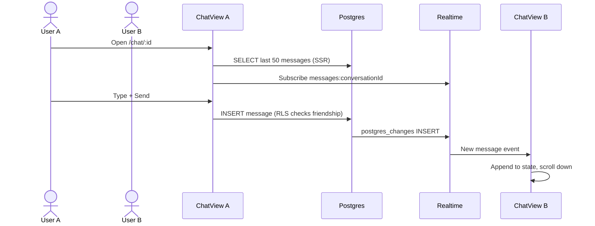

# Realtime Chat

1-on-1 text messaging between accepted friends with live delivery via Supabase Realtime.

## User flow



## Access control

Messaging requires **all** of:

1. User is a participant in the conversation (`user_a_id` or `user_b_id`).
2. An `accepted` friendship exists between the two participants.
3. `sender_id` equals `auth.uid()` on insert.

Enforced by RLS policy `messages_insert_participant` — see [data-model-and-security.md](./data-model-and-security.md).

## Message constraints

| Field | Constraint |
|-------|------------|
| `body` | 1–4000 characters |
| `type` | `"text"` only (enum in schema) |
| `conversation_id` | Must reference existing conversation |
| `sender_id` | Must be current user |

## File map

| File | Role |
|------|------|
| `apps/web/src/app/(app)/chat/[id]/page.tsx` | SSR: load conversation, verify participant, fetch messages |
| `apps/web/src/app/(app)/chat/[id]/chat-view.tsx` | Client: realtime subscription, send form, bubble UI |
| `packages/core/src/types.ts` | `Message`, `MessageType` interfaces |
| `supabase/migrations/20250625000001_initial_schema.sql` | `messages` table, RLS, realtime publication |

## Page: `/chat/[id]`

**Server-side checks:**
1. User authenticated (redirect `/login`).
2. Conversation exists and user is participant (else redirect `/home`).
3. Resolve friend profile for header title.
4. Fetch up to **50** most recent messages, ascending order.

**Renders:** `AppShell` + `ChatView` with `initialMessages`.

## ChatView component

**State:**
- `messages` — initialized from SSR, appended via realtime
- `body` — compose input text

**Realtime subscription:**
```typescript
supabase.channel(`messages:${conversationId}`)
  .on("postgres_changes", {
    event: "INSERT",
    schema: "public",
    table: "messages",
    filter: `conversation_id=eq.${conversationId}`,
  }, handler)
```

**Deduplication:** Before appending, checks `prev.some(m => m.id === row.id)`.

**Send:** Client `INSERT` with `.select().single()` — appends returned row immediately (does not rely solely on Realtime). Shows inline error on failure.

**Realtime:** Subscribes after `getSession()`; logs channel status; banner if not `SUBSCRIBED`.

**UI:**
- Mine: right-aligned, `bg-primary`
- Theirs: left-aligned, `bg-[#1a2340]`
- Auto-scroll to bottom on new messages

## Conversation metadata

Trigger `handle_new_message()` updates `conversations.last_message_at` on every INSERT. Used by [contacts-home.md](./contacts-home.md) for sorting.

## Realtime publication

`messages` table is in `supabase_realtime` publication (migration 001).

## Known limitations

| Limitation | Plan |
|------------|------|
| Only 50 messages loaded | [message-pagination.md](../plans/phase1/message-pagination.md) |
| No typing indicators | [message-enhancements.md](../plans/phase1/message-enhancements.md) |
| No read receipts | [unread-and-read-state.md](../plans/phase1/unread-and-read-state.md) |
| No attachments | [message-enhancements.md](../plans/phase1/message-enhancements.md) |
| No edit/delete | [message-enhancements.md](../plans/phase1/message-enhancements.md) |
| Realtime-only delivery (fixed) | Sender now appends from INSERT response — see [troubleshooting.md](../feature-tests/chat/troubleshooting.md) |

## Testing

Manual test guide and scenario plan: [feature-tests/chat/](../feature-tests/chat/).

## Troubleshooting

If messages do not appear: [feature-tests/chat/troubleshooting.md](../feature-tests/chat/troubleshooting.md)

## Extension pattern for new message types

1. Extend `messages.type` CHECK constraint in migration.
2. Add type to `MessageType` in `packages/core`.
3. Update `ChatView` render switch for new bubble formats.
4. Add RLS if new types need different insert rules.