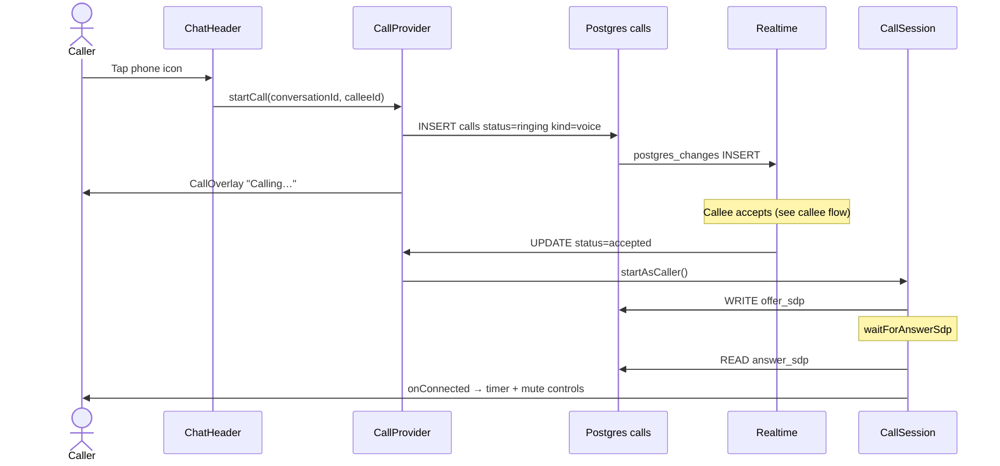
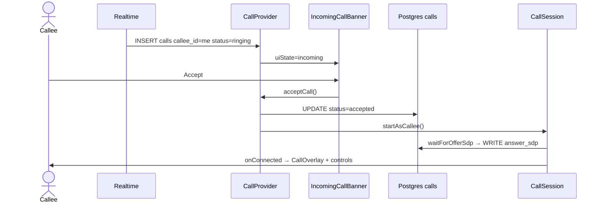

# Voice Calling

1-on-1 voice calls between accepted friends via WebRTC audio and Supabase Realtime signaling. Initiated from the chat header; incoming calls surface globally while the app is open.

> **Scope:** Voice only (v1). Video is deferred — see [phase4/voice-video-calling.md](../plans/phase4/voice-video-calling.md).

## User flow — caller



## User flow — callee



## Access control

Calling requires **all** of:

1. User is a participant in the conversation (`user_a_id` or `user_b_id`).
2. An `accepted` friendship exists between caller and callee.
3. `caller_id` equals `auth.uid()` on insert.

Enforced by RLS policy `calls_insert_caller` — see migration `20250629000001_restore_calls.sql`.

## Call states

| Status | Meaning | Who sets |
|--------|---------|----------|
| `ringing` | Outgoing ring in progress | Caller on INSERT |
| `accepted` | Callee answered; WebRTC negotiates | Callee |
| `ended` | Normal hang up | Either participant |
| `rejected` | Callee declined | Callee |
| `missed` | No answer within 45s | Caller (timeout) |
| `busy` | Callee already in a call | Callee side auto-mark |

State transitions are validated in `@calling-app/core` (`assertTransition`) before every UPDATE.

## File map

| File | Role |
|------|------|
| `apps/web/src/contexts/call-context.tsx` | `CallProvider` — UI state, Realtime subscriptions, timeouts, session lifecycle |
| `apps/web/src/lib/call/call-session.ts` | `CallSession` — wires signaling + WebRTC for caller/callee |
| `apps/web/src/lib/call/signaling.ts` | CRUD on `calls`, SDP read/write, Realtime subscribe helpers |
| `apps/web/src/lib/call/outgoing.ts` | `startOutgoingCall()` — INSERT `kind=voice` row |
| `apps/web/src/lib/call/peer-connection.ts` | RTCPeerConnection, offer/answer, ICE gather, remote audio |
| `apps/web/src/lib/call/media.ts` | `getUserMedia`, `fetchIceServers` via `/api/turn` |
| `apps/web/src/lib/call/timeouts.ts` | `RING_TIMEOUT_MS` (45s), `REALTIME_GRACE_MS` (8s) |
| `apps/web/src/lib/call/active-call-registry.ts` | Hook for `SessionGuard` to end call on session replace |
| `apps/web/src/components/call/call-overlay.tsx` | Full-screen overlay — outgoing, connecting, connected, ended |
| `apps/web/src/components/call/incoming-call-listener.tsx` | Renders banner when `uiState === "incoming"` |
| `apps/web/src/components/call/incoming-call-banner.tsx` | Accept / Decline UI |
| `apps/web/src/components/call/call-controls.tsx` | Mute toggle + hang up |
| `apps/web/src/components/chat/chat-header.tsx` | Phone icon → `startCall` |
| `apps/web/src/app/(app)/layout.tsx` | Mounts `CallProvider`, `IncomingCallListener`, `CallOverlay` |
| `apps/web/src/app/api/turn/route.ts` | Authenticated TURN credential proxy |
| `packages/core/src/types.ts` | `CallRecord`, `CallStatus`, `CallKind` |
| `packages/core/src/call/state-machine.ts` | Transition rules per role |
| `supabase/migrations/20250629000001_restore_calls.sql` | `calls` table, RLS, Realtime publication |

## CallProvider + CallSession architecture

`CallProvider` owns **application state**; `CallSession` owns **WebRTC + SDP exchange**.

```
CallProvider
├── Realtime channel `calls:{userId}`
│   ├── INSERT (callee_id=me) → incoming banner or mark busy
│   └── UPDATE → terminal status / trigger caller session on accepted
├── UI state machine: idle → incoming | outgoing → connecting → connected → ended
├── Ring timer (45s) → markCallMissed
├── Realtime disconnect grace → auto endCall
└── sessionRef → CallSession instance

CallSession
├── startAsCaller: setupPeer → createOffer → writeOfferSdp → waitForAnswerSdp
├── startAsCallee: waitForOfferSdp → setupPeer → createAnswer → writeAnswerSdp
├── hangUp: endCall row + cleanup tracks/pc (idempotent)
└── mute/unmute: toggle local audio track enabled
```

**ICE strategy:** Full SDP gathering before write (no trickle ICE). Dev console logs `iceConnectionState` in development.

## API: `GET /api/turn`

| | |
|---|---|
| **Auth** | Required (Supabase session cookie) |
| **Response** | `{ iceServers: RTCIceServer[], warning?: string }` |
| **Provider** | Metered.ca short-lived credentials |

Fetches from `https://{METERED_TURN_APP_NAME}.metered.live/api/v1/turn/credentials?apiKey=...` and merges Google STUN. Without env keys, returns STUN-only with a `warning` — same-LAN only.

See [infrastructure.md](./infrastructure.md) for Metered setup.

## Schema: `calls`

| Column | Type | Notes |
|--------|------|-------|
| `id` | uuid PK | |
| `conversation_id` | uuid FK | Must match friendship conversation |
| `caller_id` | uuid FK | Inserting user |
| `callee_id` | uuid FK | Other participant |
| `kind` | text | `voice` or `video` (v1 uses `voice` only) |
| `status` | text | See state table above |
| `offer_sdp` | text | Caller writes after `createOffer` |
| `answer_sdp` | text | Callee writes after `createAnswer` |
| `started_at` | timestamptz | Set on `accepted` |
| `ended_at` | timestamptz | Set on terminal statuses |
| `created_at` | timestamptz | Row insert time |

**Realtime:** Table is in `supabase_realtime` publication with `replica identity full`.

## Environment variables

| Variable | Scope | Required | Purpose |
|----------|-------|----------|---------|
| `METERED_TURN_API_KEY` | Server only | Prod recommended | Metered credential API key |
| `METERED_TURN_APP_NAME` | Server only | Prod recommended | Metered app subdomain |

Without TURN keys, calls work on same LAN only. HTTPS is required for `getUserMedia` in production.

## UI components

| Component | When visible | Actions |
|-----------|--------------|---------|
| `ChatHeader` phone button | Chat view, `canMessage && uiState === "idle"` | Start outgoing call |
| `IncomingCallBanner` | Any app page, incoming ring | Accept / Decline |
| `CallOverlay` | Outgoing, connecting, connected, ended | Cancel / hang up, mute when connected |
| `CallControls` | Inside overlay | Mute toggle, red hang-up (Escape also ends) |

Design tokens: `--chat-surface`, `--chat-coral`, `--danger`. `aria-live="polite"` on overlay status.

## Edge cases (v1)

| Scenario | Behavior |
|----------|----------|
| 45s no answer | Caller sees "No answer"; DB `missed` |
| Callee declines | Caller sees "Declined"; DB `rejected` |
| Second call while busy | New row → `busy` |
| Caller cancels while ringing | `ended`; callee banner dismisses |
| Login on second device | `SessionGuard` ends active call |
| Tab close | `beforeunload` best-effort `endCall` |
| Realtime disconnect mid-call | 8s grace, then auto end |

## Manual testing

See [feature-tests/call/manual-testing.md](../feature-tests/call/manual-testing.md).

## Implementation plan

Shipped via [feature-call plan](../plans/feature-call/README.md) (tasks 00–12).