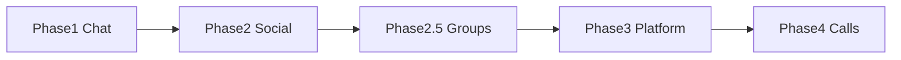

# Future Rollout Plans

Phased roadmap for extending CallingApp. Each phase has its own folder with detailed plan docs.

**Active phase:** [Phase 1 — End-to-End Chat](./phase1/README.md)

## Phases

| Phase | Theme | Status | Index |
|-------|-------|--------|-------|
| 1 | End-to-end chat + good UI | **Active** | [phase1/README.md](./phase1/README.md) |
| 2 | Social & identity (remove/block, avatars, no presence) | Planned | [phase2/README.md](./phase2/README.md) |
| 2.5 | Group chat (≤5 members) | Planned | [phase2/group-chat.md](./phase2/group-chat.md) |
| 3 | Platform & reach (PWA, push) | Planned | [phase3/README.md](./phase3/README.md) |
| 4 | Voice & video calling | Deferred | [phase4/README.md](./phase4/README.md) |
| — | **Voice calling (active)** | `feature-call` branch | [feature-call/README.md](./feature-call/README.md) |

## Phase 1 at a glance

| Doc | Effort |
|-----|--------|
| [end-to-end-chat.md](./phase1/end-to-end-chat.md) | Umbrella spec |
| [database-cleanup.md](./phase1/database-cleanup.md) | Small |
| [message-pagination.md](./phase1/message-pagination.md) | Small |
| [message-enhancements.md](./phase1/message-enhancements.md) | Medium |
| [emoji-support.md](./phase1/emoji-support.md) | Small |
| [message-deletion.md](./phase1/message-deletion.md) | Medium |

## Phase 3 at a glance (includes deferred Phase 1 items)

| Doc | Effort |
|-----|--------|
| [unread-and-read-state.md](./phase3/unread-and-read-state.md) | Medium |
| [message-notifications.md](./phase3/message-notifications.md) | Medium |
| [typing-indicators.md](./phase3/typing-indicators.md) | Small |
| [pwa.md](./phase3/pwa.md) | Medium |
| [notifications.md](./phase3/notifications.md) | Large |

## Phase 2 at a glance

| Doc | Effort |
|-----|--------|
| [remove-and-block-friends.md](./phase2/remove-and-block-friends.md) | Medium |
| [profile-pictures.md](./phase2/profile-pictures.md) | Medium |
| [disable-presence.md](./phase2/disable-presence.md) | Small |

## Guiding principles

1. **Chat-first** — Text messaging remains the core experience; other features augment it.
2. **RLS by default** — New tables and mutations must ship with row-level security policies.
3. **Schema before UI** — Migrations and types land before pages and components.
4. **Document on ship** — Completed work updates `architecture/features/`; mark phase exit criteria done.

## How to execute a plan

1. Read the phase README and umbrella spec (Phase 1: [end-to-end-chat.md](./phase1/end-to-end-chat.md)).
2. Read the specific plan doc end-to-end.
3. Create a migration if schema changes are required.
4. Update `packages/core` types and utilities.
5. Implement API routes (if needed), then UI.
6. Add or extend unit tests.
7. Update the feature doc under `architecture/features/`.
8. Check off exit criteria in the phase README.