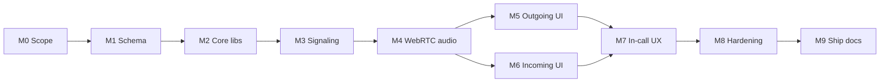
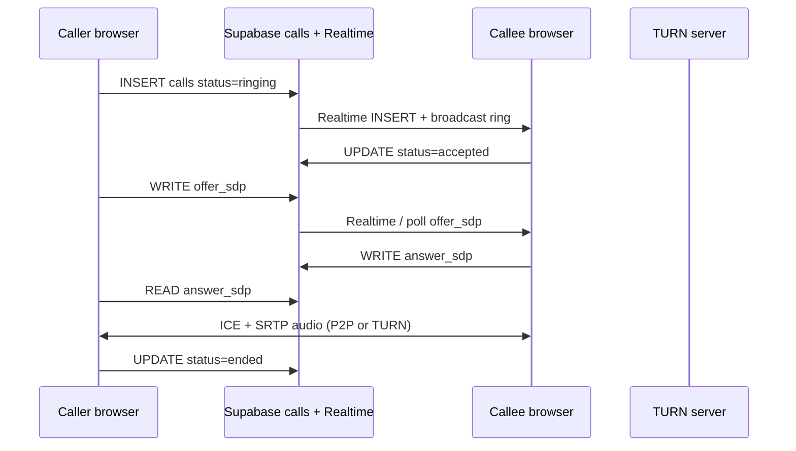

# Feature: 1-on-1 Voice Calling

Branch: `feature-call`

Re-introduce **voice calls** between accepted friends using WebRTC for media and Supabase for signaling. Video is a follow-up milestone after voice is stable.

**Prior art:** [phase4/voice-video-calling.md](../phase4/voice-video-calling.md) · Original schema in `20250625000001_initial_schema.sql` · Dropped by `20250627000001_drop_calls.sql`

---

## v1 product contract

| Rule | v1 behavior |
|------|-------------|
| Who can call | Accepted friends only (same gate as chat) |
| Call types | **Voice only** |
| Direction | 1-on-1, either friend can initiate from chat |
| Signaling | Supabase Realtime + Postgres SDP columns |
| Media path | WebRTC P2P with TURN fallback |
| Incoming UX | In-app ring UI while app is open (no push yet) |
| E2EE | **Not in v1** — SRTP via DTLS; treat as transport-encrypted like Zoom/WhatsApp calls |
| Multi-device | One active call per user; second incoming → busy |

---

## Milestones

Complete milestones in order. Check off tasks in [tasks/README.md](./tasks/README.md) as you land each one.

| Milestone | Goal | Tasks | Exit criteria |
|-----------|------|-------|---------------|
| **M0 — Scope** | Agree v1 boundaries | 00 | Voice-only spec signed off |
| **M1 — Schema** | Restore `calls` table + RLS | 01 | Migration applied; Realtime publication on |
| **M2 — Core libs** | Types + state machine in `@calling-app/core` | 02 | Unit tests for transitions |
| **M3 — Signaling** | Ring / accept / SDP relay | 03, 04 | Two-browser signaling without media |
| **M4 — WebRTC audio** | Peer connection + TURN | 05, 06 | Local loopback or two-tab audio works |
| **M5 — Outgoing UI** | Call button + caller flow | 07, 08 | Caller hears ringback → connected audio |
| **M6 — Incoming UI** | Global listener + answer UI | 09 | Callee sees ring → answer → audio |
| **M7 — In-call UX** | Overlay, mute, hang up, timer | 10 | Full happy path both sides |
| **M8 — Hardening** | Timeouts, busy, missed, reject | 11 | Edge cases covered in manual tests |
| **M9 — Ship** | Feature doc + test guide | 12 | `architecture/features/voice-calling.md` |

**Future M10 (video):** camera preview, remote video tile, callee send-video — separate task set after M9.

---

## Architecture (v1)

| Layer | Responsibility |
|-------|----------------|
| `calls` table | Call record, status, SDP storage, history |
| Realtime | Fast ring/accept/hangup events |
| `/api/turn` | Short-lived TURN credentials (Metered or coturn) |
| `packages/core` | Call types, state machine, pure helpers |
| `apps/web/src/lib/call/` | WebRTC, signaling, session lifecycle |
| `apps/web/src/components/call/` | Overlay, incoming banner, controls |

---

## Prerequisites

| Prerequisite | Status | Notes |
|--------------|--------|-------|
| Accepted friendship + conversation | Shipped | Reuse chat participant checks |
| HTTPS (local + prod) | Required | WebRTC `getUserMedia` |
| TURN provider | **Setup needed** | `METERED_TURN_API_KEY` or self-hosted coturn |
| `calls` table on remote DB | **Dropped** | Task 01 restores it |

**Deferred to later:** Web Push for background incoming calls ([phase3/notifications.md](../phase3/notifications.md)).

---

## How we work (task-by-task)

1. Pick the next unchecked task in [tasks/README.md](./tasks/README.md).
2. Read the task file end-to-end.
3. Implement → `pnpm test` + `pnpm build`.
4. Manual check using task **Verify** steps (two browsers).
5. Check off task in `tasks/README.md` and commit: `feat(call): <task title>`.
6. Repeat until milestone exit criteria pass.

**Commit discipline:** Prefer ≤100 lines, ≤3 files per commit (split task if needed).

---

## Manual test environment

- **Browser A + B:** normal window + incognito (two Google accounts, accepted friends).
- **Mic:** Both tabs need microphone permission.
- **Network:** Test once on same LAN, once with one side on mobile hotspot (TURN path).

---

## Risks

| Risk | Mitigation |
|------|------------|
| NAT blocks P2P | TURN required in prod; test early in M4 |
| Large SDP over Realtime | Store SDP in Postgres columns (prior design) |
| Single-device session kicks mid-call | End call on `session_replaced` (task 11) |
| Concurrent calls | Reject second call with `busy` status |

---

## Task index

See [tasks/README.md](./tasks/README.md).