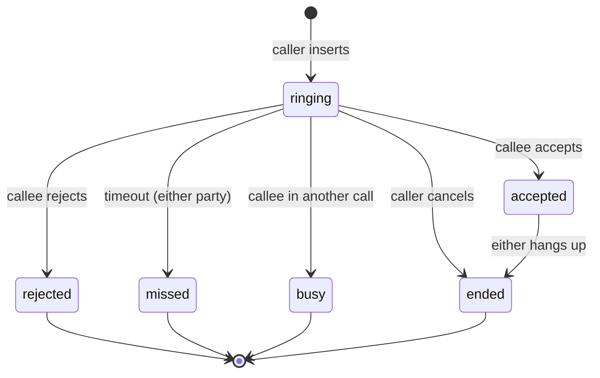

# Task 02 — Core Types and State Machine

**Milestone:** M2 · **Depends on:** 01 · **Est.:** 3h · **Status:** ✅ Done

## Goal

Pure call types and transition rules in `@calling-app/core` (no React, no WebRTC).

## Checklist

- [x] `CallKind`: `'voice' | 'video'`
- [x] `CallStatus`: `'ringing' | 'accepted' | 'ended' | 'missed' | 'rejected' | 'busy'`
- [x] `CallRecord` interface matching DB row
- [x] `CallRole`: `'caller' | 'callee'`
- [x] `canTransition(from, to, role)` — valid status changes
- [x] `isTerminal(status)` — ended, missed, rejected, busy
- [x] Unit tests for all valid/invalid transitions

## State diagram



## Verify

```bash
pnpm --filter @calling-app/core test
```

- [x] Invalid transitions return false (e.g. `ended → ringing`)
- [x] Caller cannot accept; callee cannot end before accept

## Files

| File | Action |
|------|--------|
| `packages/core/src/types.ts` | Extended |
| `packages/core/src/call/state-machine.ts` | Created |
| `packages/core/src/call/state-machine.test.ts` | Created |
| `packages/core/src/call/index.ts` | Created |
| `packages/core/src/index.ts` | Export call module |