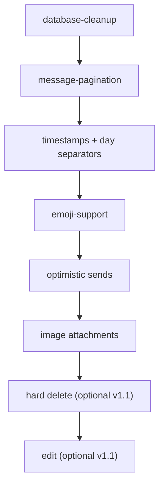

# Phase 1 — End-to-End Chat

**Status:** Active  
**Goal:** Ship a polished 1-on-1 chat experience: full history, instant text sends, emoji, and image attachments.

## Documents

| Doc | Purpose |
|-----|---------|
| [end-to-end-chat.md](./end-to-end-chat.md) | **Start here** — umbrella spec and refinement doc |
| [database-cleanup.md](./database-cleanup.md) | Remove legacy `calls` schema |
| [message-pagination.md](./message-pagination.md) | Load older message history |
| [message-enhancements.md](./message-enhancements.md) | Timestamps, optimistic sends, images, edit |
| [emoji-support.md](./emoji-support.md) | Emoji picker + rendering (no schema) |
| [message-deletion.md](./message-deletion.md) | Hard delete — message block gone entirely |

**Deferred to Phase 3** (not Phase 1 scope):

| Doc | Purpose |
|-----|---------|
| [unread-and-read-state.md](../phase3/unread-and-read-state.md) | Unread badges and read cursors |
| [message-notifications.md](../phase3/message-notifications.md) | Global Realtime listener, live home updates, browser toasts |
| [typing-indicators.md](../phase3/typing-indicators.md) | "Alex is typing…" broadcast |

## Execution order

1. [database-cleanup.md](./database-cleanup.md) — done
2. [message-pagination.md](./message-pagination.md) — done
3. [message-enhancements.md](./message-enhancements.md) — timestamps, optimistic — done; **images next**
4. [emoji-support.md](./emoji-support.md) — done
5. [message-deletion.md](./message-deletion.md) — hard delete (v1.1 stretch)

## Depends on

Phase 0 (shipped): auth, friends, basic realtime chat — see [../../features/](../../features/).

## Exit criteria

Phase 1 is complete when:

- [x] User can scroll/load full message history
- [x] Chat UI is polished (bubbles, timestamps, day groups, compose bar)
- [x] Text sends feel instant (optimistic) with error recovery
- [ ] Image attachments send and display inline
- [x] Emoji picker works in compose bar
- [x] Legacy `calls` table removed from database
- [ ] User can hard-delete own messages (block gone for both users) — **v1.1 stretch**

**Moved to Phase 3:** typing indicators, unread badges, home preview, in-app notifications.

## Next phase

[Phase 2 — Social & Identity](../phase2/README.md), then [Phase 3 — Platform & Reach](../phase3/README.md) for home unread, notifications, and typing.