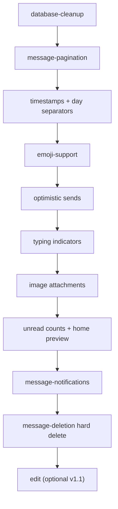

# Phase 1 — End-to-End Chat

**Status:** Active  
**Goal:** Ship a polished 1-on-1 chat experience from contacts list through real-time text and image messaging.

## Documents

| Doc | Purpose |
|-----|---------|
| [end-to-end-chat.md](./end-to-end-chat.md) | **Start here** — umbrella spec and refinement doc |
| [database-cleanup.md](./database-cleanup.md) | Remove legacy `calls` schema |
| [message-pagination.md](./message-pagination.md) | Load older message history |
| [message-enhancements.md](./message-enhancements.md) | Timestamps, typing, optimistic sends, images, edit |
| [emoji-support.md](./emoji-support.md) | Emoji picker + rendering (no schema) |
| [unread-and-read-state.md](./unread-and-read-state.md) | Unread badges and read cursors |
| [message-notifications.md](./message-notifications.md) | Global Realtime listener, live home updates, browser toasts |
| [message-deletion.md](./message-deletion.md) | Hard delete — message block gone entirely |

## Execution order

1. [database-cleanup.md](./database-cleanup.md)
2. [message-pagination.md](./message-pagination.md)
3. [message-enhancements.md](./message-enhancements.md) — timestamps → optimistic → typing → images → edit (stretch)
4. [emoji-support.md](./emoji-support.md) — after timestamps (can run in parallel with optimistic)
5. [unread-and-read-state.md](./unread-and-read-state.md)
6. [message-notifications.md](./message-notifications.md) — after unread-and-read-state
7. [message-deletion.md](./message-deletion.md) — hard delete (v1.1)

## Depends on

Phase 0 (shipped): auth, friends, basic realtime chat — see [../../features/](../../features/).

## Exit criteria

Phase 1 is complete when:

- [x] User can scroll/load full message history
- [x] Chat UI is polished (bubbles, timestamps, day groups, compose bar)
- [ ] Text sends feel instant (optimistic) with error recovery
- [ ] Typing indicator works between two users
- [ ] Image attachments send and display inline
- [ ] Home contacts show unread count and last message preview
- [ ] Opening a chat clears unread state
- [ ] New messages update home list and unread badges without refresh
- [ ] No spurious alerts while viewing the active chat
- [x] Emoji picker works in compose bar
- [ ] User can hard-delete own messages (block gone for both users)
- [x] Legacy `calls` table removed from database

## Next phase

[Phase 2 — Social & Identity](../phase2/README.md)