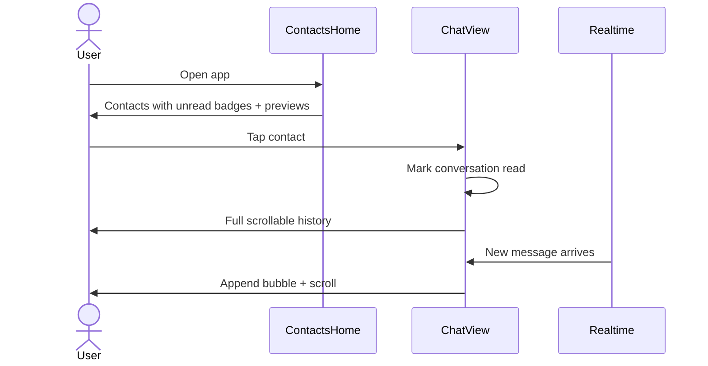
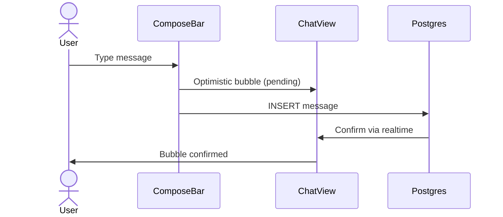
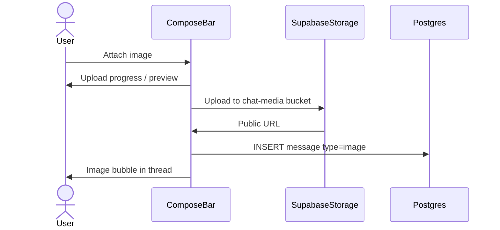

# Phase 1 Spec: End-to-End Chat

Umbrella specification for Phase 1. Sub-docs cover implementation detail; **this doc defines the product outcome** and will be refined in collaboration.

## Vision

A user can open a conversation, read full scrollable history, send text and images in real time with instant feedback — all in a polished mobile-first UI. Home unread badges, live previews, and typing indicators are Phase 3.

## Current baseline

What ships today (see [realtime-chat.md](../../features/realtime-chat.md)):

| Area | Current state |
|------|---------------|
| Message delivery | Realtime via Supabase `postgres_changes` |
| History | Last 50 messages only (SSR) |
| Bubbles | Basic left/right alignment, no grouping |
| Timestamps | Not shown |
| Compose | Single-line input + Send button |
| Images | Not supported |
| Typing | Not supported |
| Optimistic send | Not implemented |
| Home list | Name + public ID only; sorted by `last_message_at` |
| Unread | Not tracked |

Key file: [`apps/web/src/app/(app)/chat/[id]/chat-view.tsx`](../../../apps/web/src/app/(app)/chat/[id]/chat-view.tsx)

## User journeys

### Journey 1 — Return and catch up

### Journey 2 — Send text

### Journey 3 — Send image

## UI requirements

> **To refine** — checklist for design pass. Mark decisions as we go.

### Contacts home (`/home`)

- [ ] Contact row: avatar placeholder (initials until Phase 2)
- [ ] Display name + last message preview (truncated)
- [ ] Relative time of last message
- [ ] Unread count badge
- [ ] Bold name when unread > 0
- [ ] Empty state when no contacts

### Chat screen (`/chat/[id]`)

- [ ] Header: back to home, friend display name
- [ ] Message list: scrollable, fills available height
- [ ] Day separators ("Today", "Yesterday", date)
- [ ] Message grouping: consecutive messages from same sender
- [ ] Timestamps: per bubble or group (relative)
- [ ] Text bubbles: distinct mine vs theirs styling
- [ ] Image bubbles: inline preview, tap to expand (optional v1)
- [ ] "Load older messages" or infinite scroll at top
- Typing indicator — Phase 3 ([typing-indicators.md](../phase3/typing-indicators.md))
- [ ] Compose bar: multiline input, send button, attach image button
- [ ] Pending/failed send states
- [ ] Empty thread state
- [ ] Loading skeleton for initial fetch

### Cross-cutting

- [ ] Consistent with dark theme ([ui-shell.md](../../features/ui-shell.md))
- [ ] Mobile-first; usable at `max-w-lg`
- [ ] Accessible: focus states, aria labels on actions

## Technical work packages

| # | Package | Doc | Schema change |
|---|---------|-----|---------------|
| 0 | Legacy cleanup | [database-cleanup.md](./database-cleanup.md) | Drop `calls` table |
| 1 | History | [message-pagination.md](./message-pagination.md) | None |
| 2 | Message UX | [message-enhancements.md](./message-enhancements.md) | `attachment_url`, `type` enum |
| 2b | Emoji | [emoji-support.md](./emoji-support.md) | None |
| 2c | Delete | [message-deletion.md](./message-deletion.md) | `removed_at`, `message_hides`, UPDATE RLS |
| 3 | Unread + home + notifications | [Phase 3](../phase3/README.md) | `conversation_reads` table |

### Recommended v1 scope vs v1.1

| Feature | v1 (ship) | v1.1 (stretch) |
|---------|-----------|----------------|
| Pagination | Yes | — |
| Timestamps + day groups | Yes | — |
| Optimistic text send | Yes | — |
| Image attachments | Yes | — |
| Typing indicator | — | Phase 3 |
| Unread badges + preview | — | Phase 3 |
| Message remove / hide | — | Yes ([message-deletion.md](./message-deletion.md)) |
| Edit messages | — | Phase 3 ([message-edit.md](../phase3/message-edit.md)) |
| Forward message | — | Phase 3 ([message-forward.md](../phase3/message-forward.md)) |
| Emoji picker | Yes | — |
| In-app message notifications | — | Phase 3 ([message-notifications.md](../phase3/message-notifications.md)) |
| Image lightbox | — | Yes |
| Infinite scroll (vs button) | Either | — |

## Files likely touched

| Path | Changes |
|------|---------|
| `apps/web/src/app/(app)/chat/[id]/chat-view.tsx` | Major refactor → decompose into chat components |
| `apps/web/src/app/(app)/chat/[id]/page.tsx` | Extended message query fields |
| `apps/web/src/app/(app)/home/page.tsx` | Preview text, unread counts |
| `apps/web/src/components/chat/` | **New** — `MessageList`, `MessageBubble`, `ComposeBar`, `DaySeparator` |
| `apps/web/src/lib/chat/` | **New** — `format-timestamp.ts`, `upload-image.ts` |
| `supabase/migrations/` | New migrations for reads + message columns + storage bucket |
| `packages/core/src/types.ts` | Extended `Message` type |

## Open questions (refinement)

Record decisions here as we refine:

| # | Question | Decision |
|---|----------|----------|
| 1 | Design reference (WhatsApp, iMessage, Telegram, custom)? | _TBD_ |
| 2 | Max image size / formats (e.g. 5MB, jpeg/png/webp)? | _TBD_ |
| 3 | Image compression client-side before upload? | _TBD_ |
| 4 | Load older: button vs infinite scroll? | _TBD_ |
| 5 | Edit/delete/forward in v1 or defer? | **Soft remove v1.1** ([message-deletion.md](./message-deletion.md)): own → "Message removed" for both; other's → hide for viewer. Edit + forward → Phase 3. |
| 6 | Last message preview on home: text only or "[Image]" for images? | _TBD_ |
| 7 | Show own messages in preview or only friend's last message? | _TBD_ |

## Acceptance criteria (phase complete)

- [ ] All items in [phase1 README exit criteria](./README.md#exit-criteria) met
- [ ] `pnpm test` and `pnpm build` pass
- [ ] Feature doc updated at `architecture/features/realtime-chat.md`
- [ ] Open questions table above has no blocking `_TBD_` entries