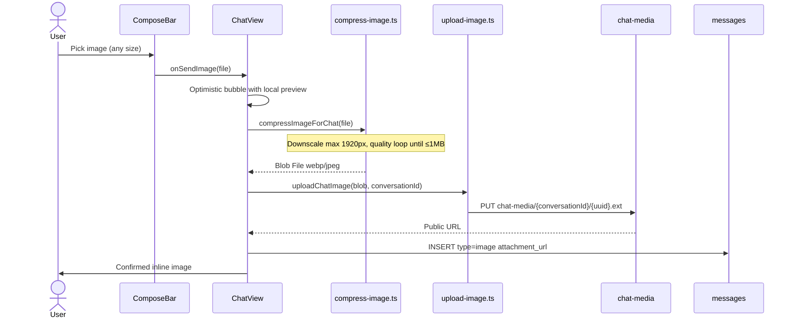

# Plan: Image Attachments

Send and display inline image messages in 1-on-1 chat. Large picks (e.g. 5 MB camera photo) are **compressed/downscaled client-side** before upload. **Ship in many small commits** — see [commit schedule](#commit-schedule) (≤100 LOC, ≤3 files each).

## Phase

**Phase 1** — Medium effort (~2 days). Last required Phase 1 exit criterion.

## Product rules (v1)

| Rule | Value |
|------|-------|
| Max upload size | **1 MB** after compression (bucket `file_size_limit` + client post-compress check) |
| Pre-compress input | Any picked file (5 MB+ photos OK — downscale first) |
| Allowed types | JPEG, PNG, WebP (output prefer **WebP** or **JPEG**) |
| Max dimension | **1920px** longest edge (config in compressor) |
| Caption | None — `body` empty for `type: image` |
| Home preview | `"[Image]"` when latest message is image |

## Dependency (frontend)

Add to `apps/web/package.json`:

```json
"browser-image-compression": "^2.0.2"
```

Used in `compress-image.ts` — resize + re-encode until blob ≤ 1 MB.

## End-to-end flow



**Recipient:** Realtime `INSERT` with `type=image` + `attachment_url` → `MessageBubble` renders ``.

---

## Commit schedule

Each row = one commit. **Hard limits:** ≤100 lines changed (excluding tests), ≤3 files. Split further if a step would exceed either limit.

### Backend (schema before UI)

| # | Message | Files (max 3) | ~LOC |
|---|---------|---------------|------|
| B1 | `feat(db): image columns on messages` | `supabase/migrations/…_image_attachments.sql` (messages only) | ~60 |
| B2 | `feat(db): chat-media storage bucket and RLS` | same migration file **or** `…_chat_media_storage.sql` if B1 already committed | ~70 |
| B3 | `feat(core): MessageType image and attachment_url` | `packages/core/src/types.ts` | ~15 |
| B4 | `docs(db): image attachment schema in data model` | `architecture/features/data-model-and-security.md` | ~40 |

**B1 migration (messages only):**
- `attachment_url text`
- `type` check `('text','image')`
- `messages_body_check` — empty body allowed when `type='image'` + `attachment_url` set

**B2 migration (storage only):**
- Bucket `chat-media`, `file_size_limit: 1048576` (1 MB)
- MIME: jpeg, png, webp
- Path: `{conversation_id}/{uuid}.{ext}`
- RLS: insert/select for conversation participants

### Frontend

| # | Message | Files (max 3) | ~LOC |
|---|---------|---------------|------|
| F1 | `chore(web): add browser-image-compression` | `apps/web/package.json`, `pnpm-lock.yaml` | ~10 |
| F2 | `feat(web): compress image helper for chat` | `apps/web/src/lib/chat/compress-image.ts`, `compress-image.test.ts` (optional, counts toward LOC budget) | ~80 |
| F3 | `feat(web): extend MessageRow for image type` | `apps/web/src/lib/chat/messages.ts` | ~25 |
| F4 | `feat(web): upload image to chat-media` | `apps/web/src/lib/chat/upload-image.ts` | ~60 |
| F5 | `feat(web): optimistic pending image messages` | `apps/web/src/lib/chat/optimistic.ts` | ~40 |
| F6 | `feat(web): compose bar image picker` | `apps/web/src/components/chat/compose-bar.tsx` | ~50 |
| F7 | `feat(web): image bubble rendering` | `apps/web/src/components/chat/message-bubble.tsx` | ~60 |
| F8 | `feat(web): chat view sendImage flow` | `apps/web/src/app/(app)/chat/[id]/chat-view.tsx` | ~90 |
| F9 | `feat(web): load image fields on chat page` | `apps/web/src/app/(app)/chat/[id]/page.tsx` | ~15 |
| F10 | `feat(web): home preview for image messages` | `apps/web/src/lib/contacts/load-contacts.ts` | ~15 |
| F11 | `docs(web): image attachments feature docs` | `architecture/features/realtime-chat.md`, `architecture/plans/phase1/README.md`, `architecture/feature-tests/chat/manual-testing.md` | ~50 |

If **F8** exceeds 100 LOC, split into:
- F8a: `sendImage` + optimistic only
- F8b: wire `ComposeBar` `onSendImage`

### `compress-image.ts` behavior

```typescript
// Pseudocode — maxOutputSizeMB: 1, maxWidthOrHeight: 1920
// Loop lower quality if still > 1 MB after first pass
export async function compressImageForChat(file: File): Promise<File>
```

Reject non-image MIME before compress. Surface clear errors: *"Could not compress image under 1 MB"* if loop fails.

---

## Out of scope (v1)

- Captions / text+image combo
- Lightbox
- Storage delete on message remove
- Server-side re-compression

## Acceptance criteria

- [x] 5 MB+ photo pick compresses to ≤1 MB before upload
- [x] Upload rejects if still >1 MB after compress
- [x] Image displays inline for sender and recipient (realtime)
- [x] Home preview `[Image]`
- [x] Invalid type rejected with clear error
- [x] `pnpm build` passes; two-user manual test documented

## Dependencies

- Phase 0 chat, pagination, optimistic text — shipped
- [message-deletion.md](./message-deletion.md) — removed images show "Message removed"