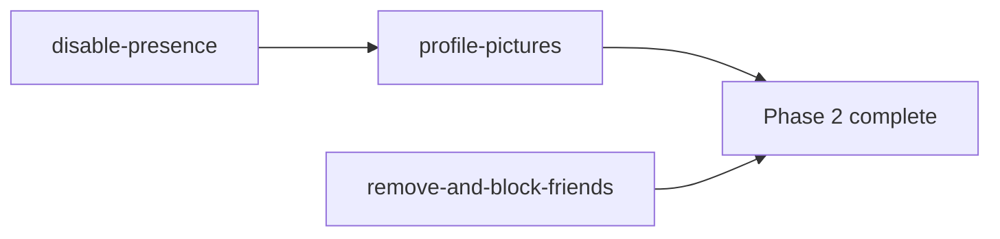
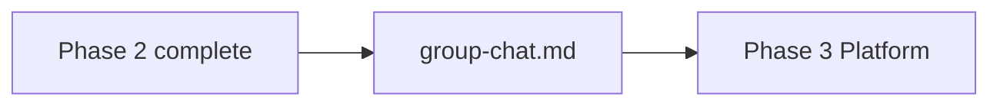

# Phase 2 — Social & Identity

**Status:** Planned  
**Goal:** Safer friend management, profile photos, and explicit no-presence policy.

## Documents

| Doc | Purpose |
|-----|---------|
| [remove-and-block-friends.md](./remove-and-block-friends.md) | Remove vs block semantics, `blocks` table, APIs |
| [profile-pictures.md](./profile-pictures.md) | Avatar upload (100 KB cap), Supabase Storage, DB |
| [disable-presence.md](./disable-presence.md) | Active / online status **off** — do not ship |
| [blocking-and-moderation.md](./blocking-and-moderation.md) | ⚠️ Superseded → see remove-and-block-friends |
| [avatars-and-presence.md](./avatars-and-presence.md) | ⚠️ Superseded → see profile-pictures + disable-presence |

## Suggested execution order

1. [disable-presence.md](./disable-presence.md) — quick policy + cleanup
2. [remove-and-block-friends.md](./remove-and-block-friends.md) and [profile-pictures.md](./profile-pictures.md) — can run in parallel

## Depends on

[Phase 1](../phase1/README.md) — chat MVP complete.

## Exit criteria

- [ ] User can **remove** an accepted friend (lookup still works for removed party)
- [ ] User can **block** a friend (blocked party cannot find blocker by public ID)
- [ ] Messages send only with **accepted** friendship
- [ ] User can upload profile picture ≤ 100 KB; larger files rejected with clear message
- [ ] Avatars display on contacts, chat, settings, lookup
- [x] **No** online / active / last-seen UI or `last_seen_at` updates

## Phase 2.5 — Group messaging (after Phase 2)

| Doc | Purpose |
|-----|---------|
| [group-chat.md](./group-chat.md) | Groups up to 5 members; schema, RLS, inbox, chat UI |

**Execute after:** Phase 1 exit criteria + Phase 2 remove/block (and ideally profile pictures).

**Not part of Phase 2 exit criteria** — groups are a separate milestone.

## Next phase

- **2.5:** [group-chat.md](./group-chat.md) (group messaging)
- **3:** [Phase 3 — Platform & Reach](../phase3/README.md)