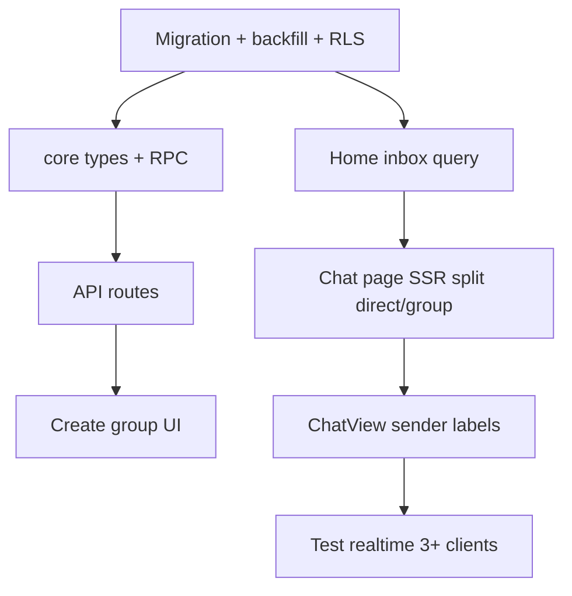

# Plan: Group Chat (up to 5 members)

**Phase:** 2.5 — Group messaging (doc lives in `phase2/`; execute after Phase 1 exit criteria and ideally after Phase 2 remove/block + profile pictures)  
**Status:** Planned  
**Goal:** Let users create small groups (2–5 people), message in real time, and see groups alongside 1:1 threads on Home.

## Why Phase 2.5 (not core Phase 2)

| Phase 2 focus | Group chat focus |
|---------------|------------------|
| Remove/block, avatars, no presence | Multi-party schema, membership RLS, unified inbox |
| Medium, parallel docs | Large (~2–3 weeks); touches DB, core, home, chat SSR + client |

Group chat **depends on** Phase 1 chat MVP and **benefits from** Phase 2 blocks (member picker) and avatars (group header, sender labels). It does not block Phase 2 exit criteria.

## Problem

Today `conversations` is a **canonical 2-person pair** (`user_a_id`, `user_b_id`). Groups do not exist. Home builds the list from **accepted friendships** only and resolves one conversation per friend via `canonicalizeParticipants()`. `ChatView` assumes a single `friendName`; bubbles have no sender label. RLS on `messages` checks pairwise `accepted` friendship.

## Product rules (v1)

| Rule | Decision |
|------|----------|
| Max size | **5 members** total (creator + up to 4 invitees) |
| Who can be invited | Users with **`accepted` friendship with the creator** at create/add time |
| Mutual friends among members | **Not required** — only creator↔invitee friendship |
| Blocked users | **Cannot** be invited; block rules from [remove-and-block-friends.md](./remove-and-block-friends.md) apply |
| Group name | Optional; default e.g. `Alex, Sam & 2 others` |
| Leave group | Member can leave; owner leaving transfers ownership or dissolves if last member |
| Add member later | Owner can add if count < 5 and new user is creator's accepted friend |
| Remove member | Owner can remove others (not self) |
| 1:1 behavior | Unchanged; existing direct rows and UX preserved |

### Friendship vs membership (messaging gate)

**Recommended v1:**

1. **Create / add member:** API validates `accepted` friendship between **creator (owner)** and each invitee; validates no block between any pair in the proposed set
2. **Send message:** RLS requires **active membership** in `conversation_members` only (no per-message clique friendship check)
3. **Remove friend (1:1):** Unchanged — RLS still blocks direct messages without `accepted` friendship

## Architecture

```mermaid
flowchart TB
  subgraph client [apps/web]
    Home[home/page.tsx]
    CreateUI[groups/create flow]
    ChatPage[chat/id/page.tsx]
    ChatView[chat-view.tsx]
    APIs[api/groups/*]
  end

  subgraph core [packages/core]
    Types[types.ts]
    ConvUtil[conversation.ts]
    MembersUtil[membership.ts - new]
  end

  subgraph db [Postgres + RLS]
    Conv[conversations type direct|group]
    Mem[conversation_members]
    Msg[messages]
    Friend[friendships]
    Block[blocks - Phase 2]
  end

  subgraph rt [Supabase Realtime]
    Pub[messages postgres_changes]
  end

  CreateUI --> APIs
  APIs --> Conv
  APIs --> Mem
  Home --> Conv
  Home --> Mem
  ChatPage --> Conv
  ChatPage --> Mem
  ChatPage --> Msg
  ChatView --> Msg
  Msg --> Pub
  Pub --> ChatView
  APIs --> Friend
  APIs --> Block
  core --> client
```

## Schema design

### 1. Extend `conversations`

```sql
alter table public.conversations
  add column type text not null default 'direct'
    check (type in ('direct', 'group')),
  add column title text,
  add column created_by uuid references public.profiles (id) on delete set null;

alter table public.conversations
  alter column user_a_id drop not null,
  alter column user_b_id drop not null;

alter table public.conversations
  drop constraint if exists conversations_ordered,
  drop constraint if exists conversations_unique_pair;

alter table public.conversations
  add constraint conversations_shape check (
    (
      type = 'direct'
      and user_a_id is not null
      and user_b_id is not null
      and user_a_id < user_b_id
    )
    or (
      type = 'group'
      and user_a_id is null
      and user_b_id is null
      and created_by is not null
    )
  );

create unique index conversations_direct_pair_unique
  on public.conversations (user_a_id, user_b_id)
  where type = 'direct';
```

### 2. New table: `conversation_members`

```sql
create table public.conversation_members (
  conversation_id uuid not null
    references public.conversations (id) on delete cascade,
  user_id uuid not null
    references public.profiles (id) on delete cascade,
  role text not null default 'member'
    check (role in ('owner', 'member')),
  joined_at timestamptz not null default now(),
  primary key (conversation_id, user_id)
);

create index conversation_members_user_id_idx
  on public.conversation_members (user_id);
```

**Max 5 enforcement:**

```sql
create or replace function public.enforce_conversation_member_limit()
returns trigger
language plpgsql
as $$
declare
  member_count int;
  conv_type text;
begin
  select c.type into conv_type
  from public.conversations c
  where c.id = new.conversation_id;

  if conv_type = 'group' then
    select count(*) into member_count
    from public.conversation_members
    where conversation_id = new.conversation_id;

    if member_count >= 5 then
      raise exception 'GROUP_MEMBER_LIMIT_EXCEEDED'
        using errcode = 'check_violation';
    end if;
  end if;
  return new;
end;
$$;

create trigger conversation_members_limit
  before insert on public.conversation_members
  for each row execute function public.enforce_conversation_member_limit();
```

### 3. RLS helper

```sql
create or replace function public.is_conversation_member(
  p_conversation_id uuid,
  p_user_id uuid default auth.uid()
)
returns boolean
language sql
stable
security definer
set search_path = public
as $$
  select exists (
    select 1
    from public.conversation_members m
    where m.conversation_id = p_conversation_id
      and m.user_id = p_user_id
  );
$$;
```

### 4. `packages/core` types

```typescript
export type ConversationType = "direct" | "group";

export interface Conversation {
  id: string;
  type: ConversationType;
  user_a_id: string | null;
  user_b_id: string | null;
  title: string | null;
  created_by: string | null;
  last_message_at: string | null;
}

export const GROUP_MEMBER_MAX = 5;
```

## Migration strategy (existing 1:1 conversations)

**Single migration** `20250XXX_group_conversations.sql`:

1. Add columns + constraints on `conversations` (all existing rows remain `type = 'direct'`)
2. Create `conversation_members`
3. **Backfill** direct members (idempotent):

```sql
insert into public.conversation_members (conversation_id, user_id, role)
select id, user_a_id, 'member' from public.conversations where type = 'direct'
on conflict do nothing;

insert into public.conversation_members (conversation_id, user_id, role)
select id, user_b_id, 'member' from public.conversations where type = 'direct'
on conflict do nothing;
```

4. Replace RLS policies to use `is_conversation_member()`
5. **Do not** remove `user_a_id` / `user_b_id` on direct rows

## RLS policies

### `messages` (update)

```sql
-- messages_select_participant
using (public.is_conversation_member(conversation_id));

-- messages_insert_participant
with check (
  auth.uid() = sender_id
  and public.is_conversation_member(conversation_id)
  and (
    -- Direct: preserve friendship gate
    exists (select 1 from public.conversations c where c.id = conversation_id and c.type = 'direct' and ...)
    or
    -- Group: membership only
    exists (select 1 from public.conversations c where c.id = conversation_id and c.type = 'group')
  )
);

-- messages_delete_own (from message-deletion.md)
using (auth.uid() = sender_id and public.is_conversation_member(conversation_id));
```

Group creation runs via `POST /api/groups/create` calling security definer RPC `create_group_conversation()`.

## API routes

| Route | Method | Purpose |
|-------|--------|---------|
| `/api/groups/create` | POST | `{ title?: string, memberIds: string[] }` — 1–4 IDs besides creator |
| `/api/groups/[id]` | PATCH | Owner: rename `{ title }` |
| `/api/groups/[id]` | DELETE | Owner: delete conversation |
| `/api/groups/[id]/members` | POST | Owner: add `{ userId }` if count < 5 |
| `/api/groups/[id]/members/[userId]` | DELETE | Owner removes member, or member removes self |

### `POST /api/groups/create` validation

1. `memberIds` length 1–4, no duplicates, none equal to `auth.uid()`
2. Each ID: `friendships.status = 'accepted'` with current user
3. No `blocks` row between creator and any invitee (Phase 2)
4. Call `create_group_conversation(creator_id, title, member_ids[])`

## UI changes

### Create group flow

| Step | UI |
|------|-----|
| Entry | Home header: extend `+` menu — **Add friend** \| **New group** (`/groups/create`) |
| Select members | Multi-select accepted friends; max 4 invitees |
| Name | Optional text field |
| Create | POST → redirect `/chat/[id]` |

**New files:**

- `apps/web/src/app/(app)/groups/create/page.tsx`
- `apps/web/src/components/groups/member-picker.tsx`

### Group header

Extend `ChatHeader`:

| Prop | Direct | Group |
|------|--------|-------|
| Title | Friend `display_name` | `title` or generated member names |
| Subtitle | None | `5 members` tappable → member list sheet |
| Avatar | Single `ChatAvatar` | Stacked avatars (max 3) or group icon |

### Sender names on bubbles

For `type === 'group'` and `!mine`:

- Pass `senderDisplayName` into `MessageBubble`
- Small label above left-aligned bubble

Direct chats: no sender label (unchanged).

### Home list

**Unified conversation list:**

| Row type | Title | Preview | Sort key |
|----------|-------|---------|----------|
| Direct | Friend name | Last message body | `last_message_at` |
| Group | Group title | `SenderFirst: body` | `last_message_at` |

Extend `ContactRow` → `ConversationRow` with `variant: 'direct' | 'group'`.

## Realtime considerations

| Topic | Approach |
|-------|----------|
| New messages | No change — filter `conversation_id=eq.{id}` in `chat-view.tsx` |
| Membership changes | v1: refetch on header mount |
| Typing (Phase 3) | Broadcast `typing:{conversationId}`; show sender name in groups — [typing-indicators.md](../phase3/typing-indicators.md) |
| Send path | Keep client INSERT + `.select().single()` |

## Cross-feature extensions

### Emoji

Same as 1:1 — UTF-8 in `body`, picker in compose bar. See [emoji-support.md](../phase1/emoji-support.md).

### Message delete

Hard delete per [message-deletion.md](../phase1/message-deletion.md) — row removed entirely for all members. Extend DELETE RLS with `is_conversation_member()`. Realtime DELETE subscription unchanged.

### Notifications

Extend [message-notifications.md](../phase3/message-notifications.md):

| Event | Recipients | Payload |
|-------|------------|---------|
| New group message | All members except sender | `title: group name`, `body: Alex: snippet` |
| Added to group | Invitee | `You've been added to {title}` |

Phase 3 push: fan-out via `conversation_members` instead of `user_a_id`/`user_b_id`. See [notifications.md](../phase3/notifications.md).

## Dependencies

### Phase 1 (required)

| Doc | Why |
|-----|-----|
| [end-to-end-chat.md](../phase1/end-to-end-chat.md) | Baseline chat UX |
| [message-pagination.md](../phase1/message-pagination.md) | Group threads need history |
| [unread-and-read-state.md](../phase3/unread-and-read-state.md) | Per-member unread |
| [emoji-support.md](../phase1/emoji-support.md) | Compose bar picker |
| [message-deletion.md](../phase1/message-deletion.md) | Hard delete in groups |
| [message-notifications.md](../phase3/message-notifications.md) | Group fan-out |

### Phase 2 (strongly recommended)

| Doc | Why |
|-----|-----|
| [remove-and-block-friends.md](./remove-and-block-friends.md) | Block-aware member picker |
| [profile-pictures.md](./profile-pictures.md) | Avatars in header, home, sender labels |
| [disable-presence.md](./disable-presence.md) | Remove "Active now" before group header |

## Acceptance criteria

### Schema & security

- [ ] Existing direct conversations work unchanged after migration
- [ ] Cannot create a group with more than 5 members (API + DB trigger)
- [ ] Non-members cannot read or send messages (RLS)
- [ ] Direct messages still require `accepted` friendship
- [ ] Group create rejects non-friends, self, duplicates, and blocked users

### API

- [ ] `POST /api/groups/create` returns conversation id visible to all members
- [ ] Owner can rename, add (<5), remove, delete group
- [ ] Member can leave; cannot remove others

### UI

- [ ] "New group" flow from Home; multi-select up to 4 friends
- [ ] Group on Home with title, preview `Name: text`, correct sort
- [ ] Chat header shows group title and member count
- [ ] Incoming bubbles in groups show sender display name
- [ ] Direct 1:1 chats unchanged

### Realtime

- [ ] All members receive new messages live without refresh

## Estimated effort

| Area | Effort |
|------|--------|
| Migration + RLS + RPC | 2–3 days |
| `packages/core` types + tests | 0.5 day |
| API routes | 1.5 days |
| Create group UI + member picker | 1–2 days |
| Home unified inbox | 1–2 days |
| Chat SSR + ChatView (header, sender names) | 1–2 days |
| Manual QA + feature doc update | 1 day |
| **Total** | **~8–12 days** |

## Implementation order



## Related files

| File | Change |
|------|--------|
| `supabase/migrations/20250625000001_initial_schema.sql` | Reference only; new migration supersedes policies |
| `packages/core/src/types.ts` | `ConversationType`, nullable pair ids |
| `packages/core/src/conversation.ts` | Direct vs group helpers |
| `apps/web/src/app/(app)/home/page.tsx` | Unified conversation query |
| `apps/web/src/app/(app)/chat/[id]/page.tsx` | Load group members + profiles |
| `apps/web/src/app/(app)/chat/[id]/chat-view.tsx` | Sender names, group placeholder |
| `apps/web/src/components/chat/chat-header.tsx` | Group variant |