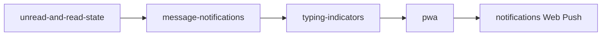

# Phase 3 — Platform & Reach

**Status:** Planned  
**Goal:** Home list awareness, in-app alerts, typing indicators, installability, and background push.

## Documents

| Doc | Purpose |
|-----|---------|
| [unread-and-read-state.md](./unread-and-read-state.md) | Unread badges and read cursors (deferred from Phase 1) |
| [message-notifications.md](./message-notifications.md) | Global Realtime listener, live home updates, browser toasts |
| [typing-indicators.md](./typing-indicators.md) | "Alex is typing…" broadcast (deferred from Phase 1) |
| [pwa.md](./pwa.md) | Service worker, installability |
| [notifications.md](./notifications.md) | Web push for messages and friend requests (app closed) |

## Execution order

1. [unread-and-read-state.md](./unread-and-read-state.md)
2. [message-notifications.md](./message-notifications.md) — after unread
3. [typing-indicators.md](./typing-indicators.md) — can run in parallel with 1–2
4. [pwa.md](./pwa.md) — service worker foundation
5. [notifications.md](./notifications.md) — push subscriptions + send pipeline

## Depends on

[Phase 1](../phase1/README.md) chat MVP (send, receive, pagination, images).  
[Phase 2](../phase2/README.md) recommended for avatars in notification richness.

## Exit criteria

- [ ] Home contacts show unread count and last message preview
- [ ] Opening a chat clears unread state
- [ ] New messages update home list and unread badges without refresh
- [ ] No spurious alerts while viewing the active chat
- [ ] Typing indicator works between two users
- [ ] App passes Lighthouse installability checks
- [ ] User can add to home screen
- [ ] Push notifications for new messages (when not in that chat)
- [ ] Push notifications for friend requests
- [ ] User can disable notifications in settings

## Next phase

[Phase 4 — Voice & Video](../phase4/README.md) (deferred)