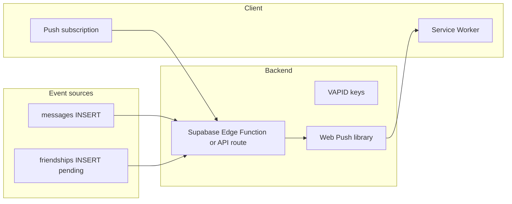

# Plan: Push Notifications

Alert users to new messages and friend requests when the app is in the background.

## Phase

**Phase 3** — Large effort; depends on PWA foundation.

## Problem

Users only see new messages when the chat page is open and subscribed to Realtime. No alerts when tab is backgrounded or app is closed.

[message-notifications.md](./message-notifications.md) covers alerts while the app is open; this plan covers the remaining gap when the client is not running.

## Notification tiers (cross-phase)

| Phase | Doc | Delivers |
|-------|-----|----------|
| 3a | [message-notifications.md](./message-notifications.md) | Unread badges, live home updates, browser `Notification` API when tab hidden (page still loaded) |
| 3 | This doc | Web Push via service worker when tab/app is closed or fully backgrounded |

This plan assumes [unread-and-read-state.md](./unread-and-read-state.md) and [message-notifications.md](./message-notifications.md) are shipped first. Do not rebuild badge or home preview logic here.

## Scope

### In scope
- Web Push via service worker (builds on [pwa.md](./pwa.md))
- Web Push only when the in-app client path cannot run (app closed or no active document)
- Notify on new message when user is not viewing that conversation (same suppression intent as [message-notifications.md](./message-notifications.md))
- Notify on incoming friend request
- Per-device subscription storage
- Settings toggle to enable/disable notifications

### Out of scope
- Unread badges and home Realtime updates ([message-notifications.md](./message-notifications.md))
- Browser Notification API while tab is open but hidden ([message-notifications.md](./message-notifications.md))
- Native iOS/Android apps
- Email notifications
- SMS

## Architecture



## Implementation steps

### 1. Database

```sql
create table public.push_subscriptions (
  id uuid primary key default gen_random_uuid(),
  user_id uuid not null references public.profiles(id) on delete cascade,
  endpoint text not null,
  p256dh text not null,
  auth text not null,
  created_at timestamptz not null default now(),
  unique (user_id, endpoint)
);
```

RLS: user can CRUD own subscriptions.

### 2. VAPID keys

Generate once; store in env:
- `VAPID_PUBLIC_KEY`
- `VAPID_PRIVATE_KEY`

### 3. Client subscription flow

1. Request `Notification.permission`
2. `registration.pushManager.subscribe()` with VAPID public key
3. `POST /api/notifications/subscribe` with subscription JSON

### 4. Send pipeline

**Option A — Supabase Database Webhook → Edge Function**
- On `messages` INSERT: look up recipient subscriptions, send push

**Option B — Next.js API route called from client** (simpler, less reliable)
- Not recommended for production

### 5. Service worker handler

```javascript
self.addEventListener("push", (event) => {
  const data = event.data.json();
  self.registration.showNotification(data.title, {
    body: data.body,
    data: { url: data.url },
  });
});

self.addEventListener("notificationclick", (event) => {
  clients.openWindow(event.notification.data.url);
});
```

### 6. Settings UI

Toggle in settings; on disable, delete subscriptions.

## Acceptance criteria

- [ ] User can opt in to notifications
- [ ] New message push opens correct `/chat/:id`
- [ ] Friend request push opens `/friends/add`
- [ ] No notification when user is actively viewing that chat (server may need presence or `last_active_conversation_id` — client suppression alone is insufficient for push)
- [ ] Unsubscribe works
- [ ] iOS 16.4+ PWA push supported (with caveats documented)

## Dependencies

- [pwa.md](./pwa.md) — service worker required
- [message-notifications.md](./message-notifications.md) — unread state + suppression contract
- [unread-and-read-state.md](./unread-and-read-state.md) — `conversation_reads` schema
- [group-chat.md](../phase2/group-chat.md) — group message fan-out (when groups ship)

## Estimated effort

**3–5 days**