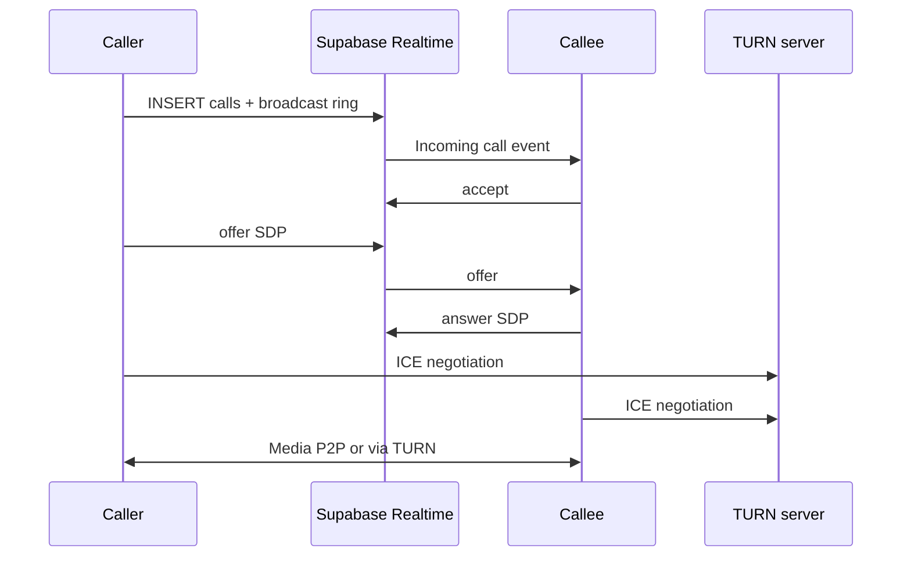

# Plan: Voice & Video Calling (Deferred)

Re-introduce 1-on-1 voice and video calls via WebRTC. **Not in current scope** — chat-only product decision.

## Phase

**Phase 4** — Large effort; implement only if product direction changes.

## Background

CallingApp previously shipped WebRTC voice/video with:
- P2P peer connections
- Supabase Realtime signaling (broadcast + Postgres SDP fallback)
- TURN via Metered.ca optional API
- Incoming call listener, call overlay UI

This was removed to focus on chat. Database artifacts may still exist — see [database-cleanup.md](../phase1/database-cleanup.md).

## Prerequisites

Before re-adding calls:

1. Decide if calls coexist with chat-only positioning
2. Restore or recreate `calls` table schema
3. TURN infrastructure (`METERED_TURN_API_KEY` or self-hosted coturn)
4. [notifications.md](../phase3/notifications.md) — critical for incoming call UX when app backgrounded
5. HTTPS required (WebRTC mandate)

## Proposed architecture (if revived)

## Components to rebuild

| Layer | Files (formerly) |
|-------|------------------|
| UI | `call-overlay.tsx`, `video-tile.tsx`, `incoming-call-listener.tsx` |
| WebRTC | `peer-session.ts`, `peer-connection.ts`, `signaling.ts`, `sdp.ts` |
| Core | `call-state-machine.ts`, signaling types |
| API | `/api/turn` |
| DB | `calls` table, `offer_sdp`, `answer_sdp`, realtime publication |

## Key technical decisions

| Decision | Recommendation |
|----------|----------------|
| Signaling transport | Supabase Realtime broadcast for events; Postgres for large SDP |
| ICE strategy | Full SDP gathering (no trickle) for simplicity |
| Video roles | Caller sends video; callee receive-only (prior design) |
| Call states | `ringing → accepted → ended` (+ `missed`, `rejected`) |

## Acceptance criteria (if implemented)

- [ ] Voice call between two accepted friends
- [ ] Video call with local preview (caller) and remote video
- [ ] Incoming call UI when callee is in app
- [ ] Mute, camera toggle, hang up
- [ ] Calls work across NAT via TURN
- [ ] Call history row in `calls` table

## Dependencies

- [database-cleanup.md](../phase1/database-cleanup.md) — **do not run** if calls are planned soon
- [notifications.md](../phase3/notifications.md)
- TURN provider account

## Estimated effort

**2–3 weeks** (full re-implementation with tests)