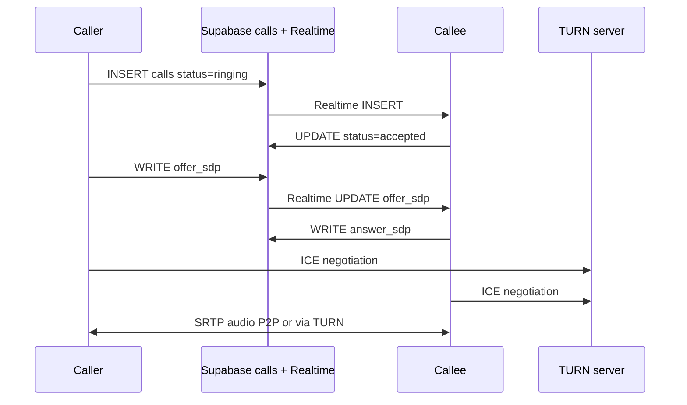

# Plan: Voice & Video Calling

Re-introduce 1-on-1 voice and video calls via WebRTC.

## Status

**Voice v1 shipped** via the [feature-call plan](../feature-call/README.md) (tasks 00–12, June 2025).

- **Shipped:** Voice-only calls, signaling, TURN, in-app incoming UI, mute/hang up
- **Doc:** [voice-calling.md](../../features/voice-calling.md)
- **Manual tests:** [feature-tests/call/manual-testing.md](../../feature-tests/call/manual-testing.md)
- **Deferred:** Video (camera preview, remote video tile), Web Push for background incoming calls

## Phase

**Phase 4** — Voice complete; video remains optional follow-up.

## Background

CallingApp previously shipped WebRTC voice/video, then removed it to focus on chat. Voice was restored in 2025 via `20250629000001_restore_calls.sql` and the feature-call task series.

## Prerequisites (voice — done)

1. ~~Restore `calls` table schema~~ — migration `20250629000001_restore_calls.sql`
2. ~~TURN infrastructure~~ — `/api/turn` + Metered.ca (STUN fallback for dev)
3. HTTPS required (WebRTC mandate)
4. Accepted friendship gate (same as chat)

**Still needed for full calling UX:**

- [notifications.md](../phase3/notifications.md) — background incoming call alerts

## Architecture (shipped — voice v1)

See [voice-calling.md](../../features/voice-calling.md) for file map and component architecture.

## Components (current)

| Layer | Files |
|-------|-------|
| UI | `call-overlay.tsx`, `incoming-call-listener.tsx`, `incoming-call-banner.tsx`, `call-controls.tsx` |
| Context | `call-context.tsx` (`CallProvider`) |
| WebRTC | `call-session.ts`, `peer-connection.ts`, `media.ts`, `signaling.ts` |
| Core | `packages/core/src/call/state-machine.ts`, call types |
| API | `/api/turn` |
| DB | `calls` table, `offer_sdp`, `answer_sdp`, realtime publication |

## Key technical decisions

| Decision | Choice (v1) |
|----------|-------------|
| Signaling transport | Postgres `calls` + Realtime `postgres_changes` |
| ICE strategy | Full SDP gathering (no trickle) |
| Call types | Voice only |
| Call states | `ringing → accepted → ended` (+ `missed`, `rejected`, `busy`) |
| Orchestration | `CallProvider` for app state; `CallSession` for WebRTC |

## Acceptance criteria

### Voice v1 (shipped)

- [x] Voice call between two accepted friends
- [x] Outgoing + incoming + in-call UI
- [x] Mute and hang up
- [x] Calls work across NAT (TURN verified)
- [x] Call history row in `calls` table
- [x] Feature doc + manual test guide

### Video (future M10)

- [ ] Video call with local preview (caller) and remote video
- [ ] Camera toggle during call
- [ ] Callee send-video path

## Dependencies

- [feature-call plan](../feature-call/README.md) — implementation tasks (voice v1 complete)
- [notifications.md](../phase3/notifications.md) — incoming call when app backgrounded
- TURN provider account (Metered.ca)

## Estimated effort (remaining)

**Video M10:** ~1 week · **Push notifications for calls:** depends on Phase 3 PWA work